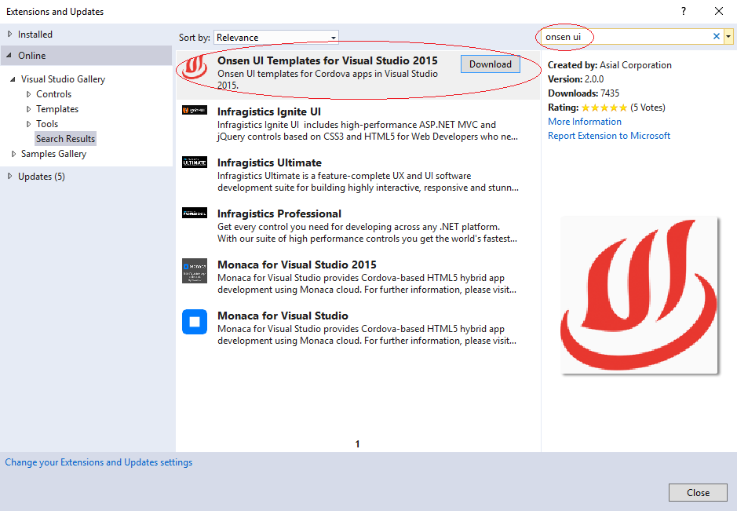
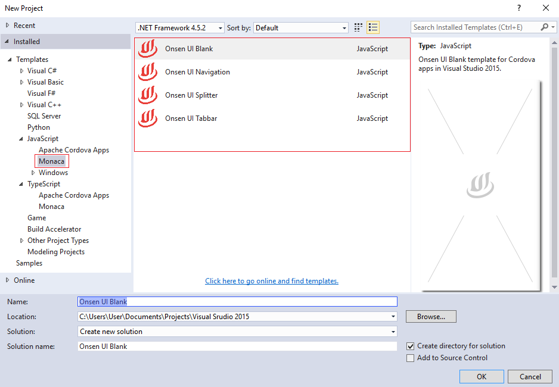
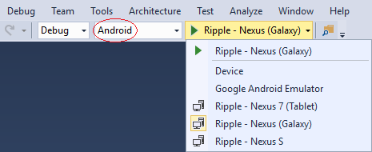
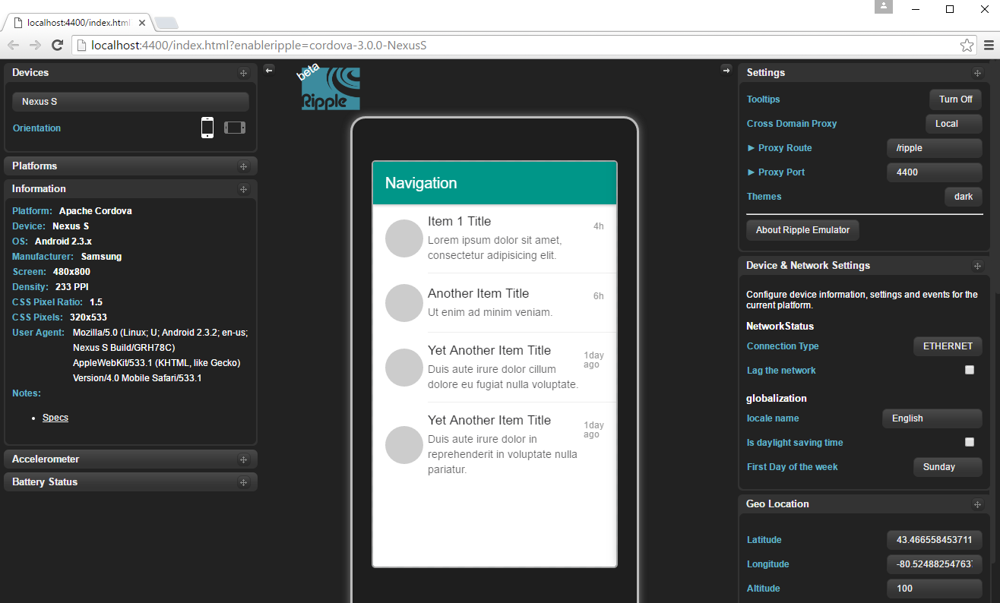
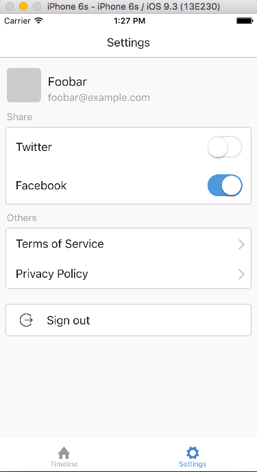
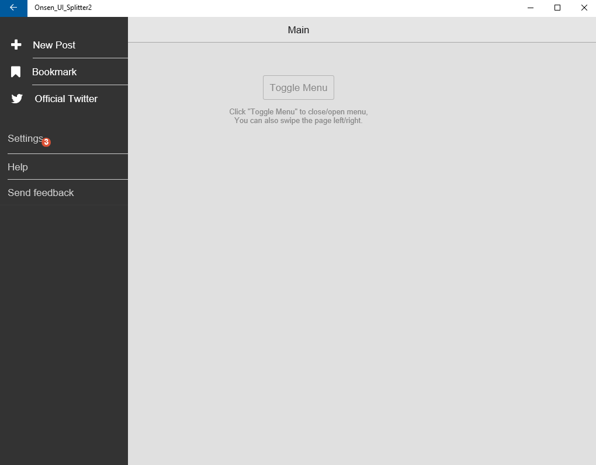
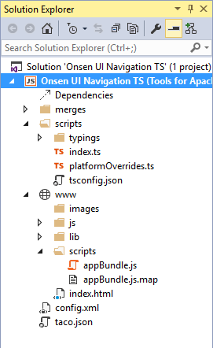
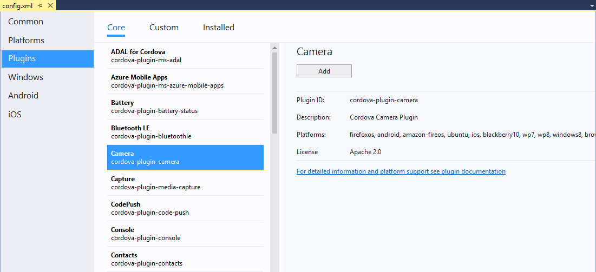
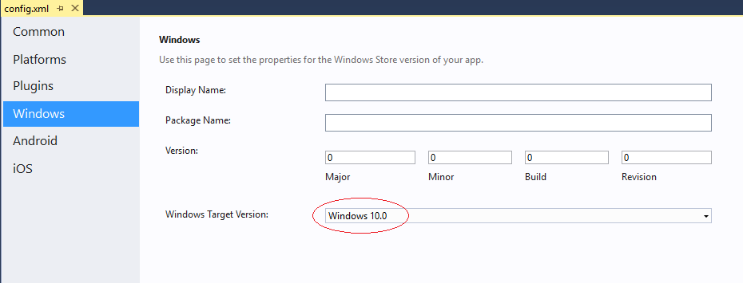

# Get started with Onsen UI apps in Visual Studio

Onsen UI is a front-end UI framework for developing cross-platform mobile apps using Apache Cordova and PhoneGap. 

[Onsen UI 2.0](https://onsen.io/v2/) was released and supports React, Angular 1 and 2, and Web Components together within your Cordova app. With more than 100 components, you can easily create great-looking HTML5 hybrid mobile apps with Material and Flat design.

Onsen UI is fully independent of frameworks - you can easily plug these components into any project, regardless of JavaScript framework. For more info, see  [Onsen UI 2.0](https://onsen.io/v2/docs/js.html).

## Get the Onsen UI templates
You can install the Onsen UI starter templates in Visual Studio and use them to start building an app.

1. If you haven't already, [install Visual Studio 2015](https://www.visualstudio.com/).

    When you install Visual Studio, make sure you include the optional components, **HTML/JavaScript (Apache Cordova)** under **Cross-Platform Mobile Development**.

    >**Note**: Quickly verify that you can load and build the default Blank App template. In Visual Studio, choose **File**, **New**, **Project**, **JavaScript**, **Apache Cordova Apps**, **Blank App** and name the new project "blank", and build it with F5.

2. Install the Onsen UI templates.

    Visit [VS Extension for Onsen UI](https://visualstudiogallery.msdn.microsoft.com/8968a18d-cc94-4ebf-8183-ed0e1f6247f3) in Visual Studio Gallery, and add it directly to Visual Studio by downloading and double-clicking on the downloaded file.

    Or, do it in Visual Studio, by selecting **Tools**, **Extensions** and **Updates**. In the **Extensions and Updates** dialog box, select **Online**. In the search box, type **Onsen UI**.

    

3. Choose **Download** to download and install them. When you are asked for permission to install the templates, give your permission.

4. Choose **Restart** to restart Visual Studio. Now, choose **File**, **New**, then **Project**. When you choose **Installed**, then **Templates**, the new starter templates will show up under both **JavaScript**, **Monaca** and **TypeScript**, **Monaca**.

    

5. Choose one of the following starter templates for your new project:

    * Onsen UI Blank
    * Onsen UI Navigation
    * Onsen UI Splitter
    * Onsen UI Tabbar

6. Choose **OK**.

7. Visual Studio creates the Onsen UI project.

## Get your app running on Android
1. Add the Android platform as a debug target (Solution Platforms list), and then choose **Build**, then **Build Solution**.

2. Choose Android as a debug target (Solution Platforms list), and to get the app running choose a target such as the **Device**, **Ripple - Nexus S** (running in a simulator environment), the **VS Emulator** (Hyper-V required) or the **Google Android Emulator** (slow to load initially).

    

    You can configure a Google Android emulator in [AVD Manager](http://taco.visualstudio.com/en-us/docs/run-app-apache/).

3. Press F5, and the app should load correctly.

    

## Get your app running on iOS
You can run initially on the Ripple Emulator after selecting iOS as a debug target, but for detailed info on setting up the remotebuild agent for iOS, see [this topic](http://taco.visualstudio.com/en-us/docs/ios-guide/).

The Onsen UI starter templates run correctly on iOS when the remotebuild agent is running on a Mac (or using an extension like [Monaca for Visual Studio 2015](https://visualstudiogallery.msdn.microsoft.com/21a7a495-5a24-4eab-a519-2f6e6d176049)), and when Visual Studio is configured to connect to it). Please note that the complete steps are outside the scope here.



## Get your app running on Windows

1. If it's not already installed, use the Visual Studio install program to install the **Universal Windows App Development Tools** (it should already be installed).

2. Open config.xml in Visual Studio, choose Windows, and in the Windows Target Version, choose Windows 10.0, and save changes.

3. Choose **Windows-x64** from the Solution Platforms list.

4. Choose a Windows deployment target, such as **Local Machine**.

5. Press F5 to run your app.

    

You can debug your Onsen UI app direct on the Windows 10 device.

1. Connect your device to the Windows OS and instead of **Windows-x64** from the Solution Platforms list you can choose for example **Windows-ARM**.

2. Choose a Windows deployment target **Device**.

3. Press F5 to run your app.


## Use TypeScript in an Onsen UI app

You can use TypeScript in an Onsen UI app.

1. Choose **File**, **New**, then **Project**. On **New Project** dialog, choose **Installed**, **Templates**, **TypeScript**, **Monaca**.

2. Choose one of the following starter templates for your new project:

    * Onsen UI Blank TS
    * Onsen UI Navigation TS
    * Onsen UI Splitter TS
    * Onsen UI Tabbar TS

3. Choose **OK**.

4. Visual Studio creates the Onsen UI project.

TypeScript source codes are located in **scripts** folder, with the extension of **.ts**. TypeScript codes will be compiled and saved as **appBundle.js** under **www/scripts** folder. You can modify the compiler options by changing **tsconfig.json** file.



## What's Next?

You can use Visual Studio's build and [debug tools](../debug-and-test/debug-using-visual-studio.md), use the configuration manager to easily [add device plugins](../develop-apps/manage-plugins.md) to your app to get up and running quick. To learn more about Onsen UI, see the [Onsen UI framework docs](https://onsen.io/v2/docs/js.html).



## Troubleshooting: Let's fix it

A few errors are fairly common in the starter templates when debugging in Visual Studio.

### Error running on Windows 8.1?

Onsen UI templates are intended to run on Windows 10 machines. Please upgrade your development environment to Windows 10 with the latest update of Visual Studio 2015.

### Unhandled exception running on Windows?

Windows apps are more strict about the security when running as a HTML5 apps. Onsen UI includes the shim to support compatibility, but you cannot use **document.write()** or access to **innerHTML**. Please read [an article that describes HTML, CSS, and JavaScript features and differences](https://msdn.microsoft.com/en-us/library/windows/apps/hh465380.aspx) for more details.

### appxrecipe file missing

If you see this error when targeting Windows 10, make sure you set Windows 10.0 as the target in the Windows tab of the configuration designer (config.xml). Then rebuild the project.



### Error saying that the Content Security Policy is missing?

Visual Studio will use the Cordova Whitelist plugin by default, so you need to update index.html in the Cordova app with the following `<meta>` element:

```html
<meta http-equiv="Content-Security-Policy" content="default-src 'self' data: gap: https://ssl.gstatic.com 'unsafe-eval'; style-src 'self' 'unsafe-inline'; media-src" *>
```

### Certificate error on Windows?

Make sure your credentials are up to date. Check for any notifications or warning icons in the upper right of Visual Studio.


You may need to re-enter your credentials. If the notifications indicate that you need to update Cordova tooling, please click on the notifications and follow instructions.

### Visual Studio Emulator for Android won't run?

The VS Emulator for Android requires Hyper-V and is not supported when running on a VM. For more info, see [this information](https://msdn.microsoft.com/en-us/library/mt228282.aspx#NoStart2).

If you have previously run the VS Emulator for Android successfully but now the emulator won't run, try deleting the emulator VM instance in Hyper-V Manager. For more info, see [Troubleshooting](https://msdn.microsoft.com/en-us/library/mt228282).

### Other issues?

If you have errors running the Blank App template (rather than just the Onsen UI starter apps), see these [troubleshooting steps](../tips-and-workarounds/general-tips.md).

If that doesn't resolve issues, post questions on [Onsen UI Community](https://community.onsen.io/).
