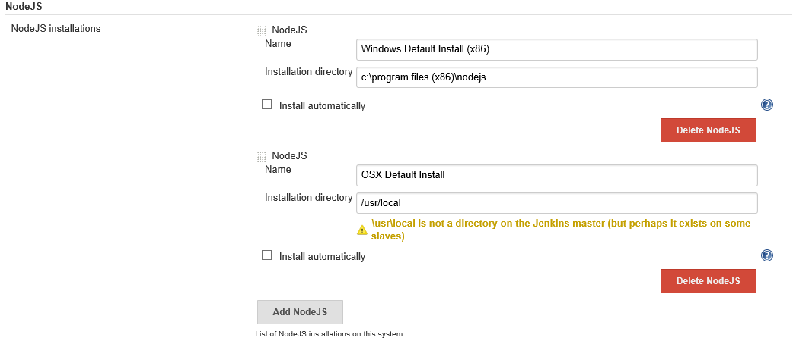
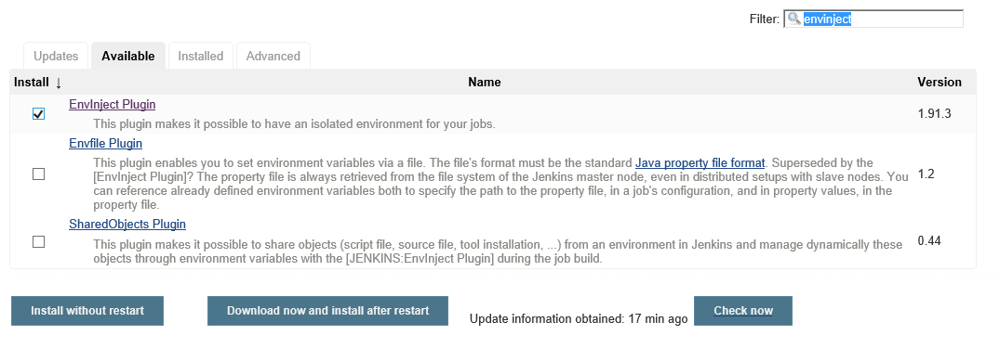
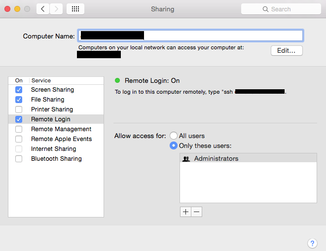
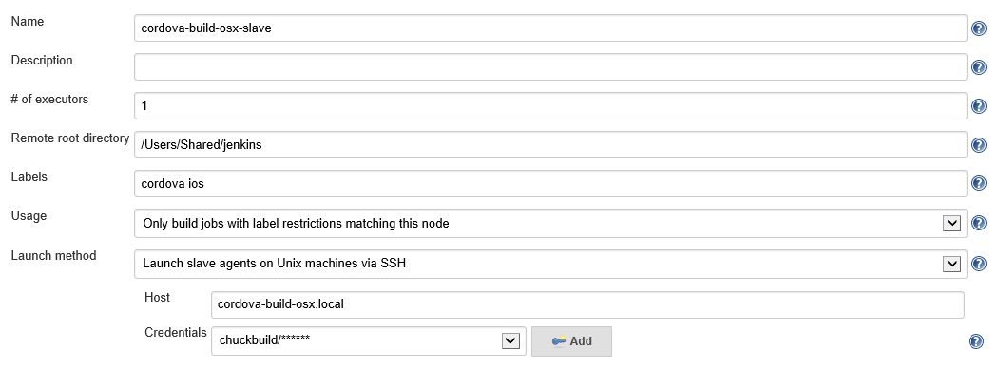
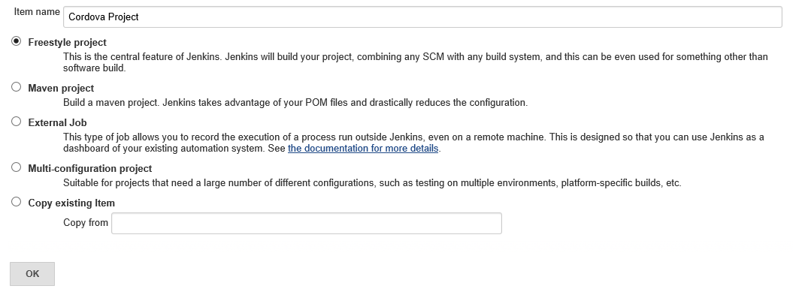
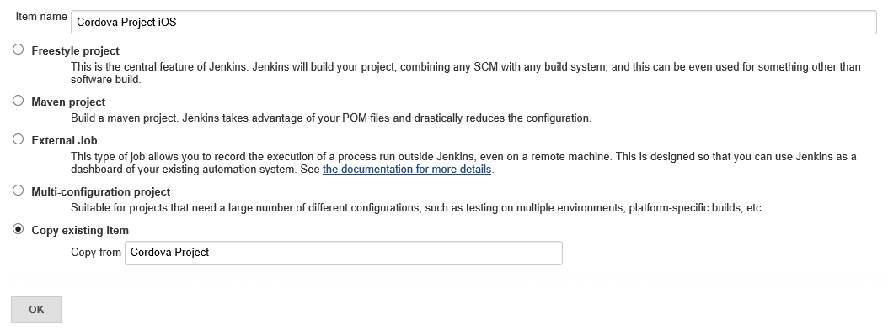
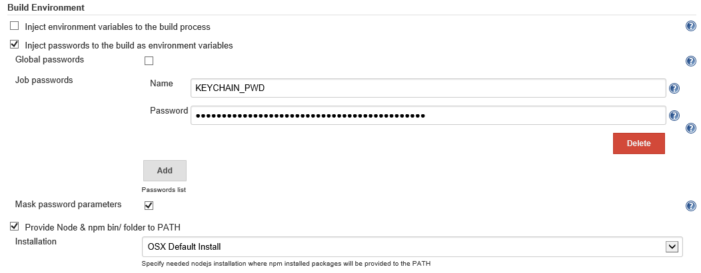

# Using Jenkins with Visual Studio Tools for Apache Cordova (TACO)

## Background

[Jenkins](http://go.microsoft.com/fwlink/?LinkID=613695) is a hugely popular CI server with a large install base so using it to build your Cordova project may be the way to go if you already have it installed and running in your environment. Fortunately Tools for Apache Cordova is designed to work with a number of different team build systems since the projects it creates are standard [Apache Cordova Command Line interface](http://go.microsoft.com/fwlink/?LinkID=533773) (CLI) projects.

[Gulp](http://go.microsoft.com/fwlink/?LinkID=533803) is an increasingly popular JavaScript based task runner with a large number of [useful plugins](http://go.microsoft.com/fwlink/?LinkID=533790) designed to automate common “tasks” for everything from compilation, to packaging, deployment, or simply copying files around. Both Gulp and Cordova CLI are Node.js based which makes the two highly complementary technologies. For these reasons, this tutorial will focus on the use Gulp rather than MSBuild as the primary build language for Cordova apps when using Jenkins.

> [!TIP]
> Be aware that we recommend against adding the Cordova project's `platforms` folder or the following JSON files in the `plugins` folder into source control: `android.json`, `ios.json`, `remote_ios.json`, `windows.json`, and `wp8.json`. See "What to Add to Source Control" in the [general CI guide](ci-guide.md#whattoadd) for additional details.

## Initial Setup

Since the build process we will describe here is not directly dependent on MSBuild or Visual Studio, you have two options for installing prerequisites on Windows:

1.  Install Visual Studio 2017 and select the Tools for Apache Cordova option and let it install the prerequisites for you

2.  Manually install only the prerequisites needed for the specific platforms you intend to build. For example, you do not need to install Visual Studio at all if you only intend to target Android. See "Installing Dependencies" in the [Building Cordova Apps in a Team / Continuous Integration Environment](ci-guide.md#depends) tutorial for details.

	 See ["Internet Access & Proxy Setup" in the general CI tutorial](ci-guide.md#proxy) if your build servers have limited Internet connectivity or require routing traffic through a proxy.

For macOS, the prerequisites will need to be installed manually, but mirror [the requirements for the Visual Studio remote build agent](http://go.microsoft.com/fwlink/?LinkID=533745). However, unlike with TFS 2013, you do not need to install the remote build agent itself if your macOS system will only be used for team / CI builds.

For the purposes of this tutorial, we will assume your primary Jenkins build server is installed on Windows. However, it is relatively straight forward to tweak these instructions to have your primary build server be on Linux or macOS. However, be aware that you will need to have a Windows [slave agent](http://go.microsoft.com/fwlink/?LinkID=613696) if you intend to build for the Windows (Windows or Windows Phone 8.1 or Windows 10) or Windows Phone 8 (WP8) Cordova platforms.

If you have not already, start out by installing and setting up up Jenkins itself. See the [Jenkins website for details](http://go.microsoft.com/fwlink/?LinkID=613697). Note that you may want to install other [Jenkins plugins](http://go.microsoft.com/fwlink/?LinkID=613704) such as the [Jenkins Git Plugin](http://go.microsoft.com/fwlink/?LinkID=613698) depending on your environment.

### Install the NodeJS Plugin
We're going to use the [Jenkins NodeJS Plugin](http://go.microsoft.com/fwlink/?LinkID=613699) to help manage our Node.js environment. Here's a quick summary of how to install it.

1. Start up Jenkins CI. If you installed it as a service on Windows, it is likely already running.

2. Open the **Jenkins Dashboard** in a web browser (typically at `http://localhost:8080/` if running locally)

3. Install the NodeJS Plugin

   1. Click **Manage Jenkins** > **Manage Plugins**.

   2. Click the **Available** tab.

   3. Filter to **NodeJS**. Note that if you do not see it in the list of options, it may already be installed.

   4. Check the **Install** checkbox, and then click **Install without restart**.

      

4. Configure the NodeJS Plugin

   1. Go to the Jenkins Dashboard again (click on **Jenkins** in the upper left hand corner).

   2. Click on **Manage Jenkins** > **Configure System**.

   3. Under **NodeJS**, add an installation locations for Windows and macOS. Set these based on your server's configuration. By default, Windows will install Node in `C:\Program Files (x86)\nodejs` while macOS installs it under `/usr/local` (technically `/usr/local/bin`).

      > [!NOTE]
      > You can ignore the warning that appears about `\usr\local` not existing on Windows.

   4. Click **Save**.

      

### Additional Setup for iOS Builds

For iOS, we will be taking advantage of an [Environment Variable Injector plugin](http://go.microsoft.com/fwlink/?LinkID=613700) and a [slave agent](http://go.microsoft.com/fwlink/?LinkID=613696) on macOS. Here's a basic walkthrough for configuring these:

1. Go to the **Jenkins Dashboard** again (click on **Jenkins** in the upper left hand corner),

2. Install the **EnvInject** Plugin

   1. Click **Manage Jenkins** > **Manage Plugins**.

   2. Click the **Available** tab

   3. Filter on **EnvInject**. Note that if you do not see it in the list of options, it may already be installed.

   4. Check the **Install** checkbox, and then click **Install without restart**.

      

      We will use the EnvInject plugin in our Jenkins project build config for macOS later in this tutorial.

3. Prep macOS for Use with a Slave Agent

	1. First, if you have not already done so, [install the Java SE JDK](http://go.microsoft.com/fwlink/?LinkID=613705) on your macOS build server as the agent will use it. (The Java runtime environment [JRE] alone is not sufficient.)

	2. Next we need to enable SSH. On your macOS Machine:

		1. Go to **Settings** > **Sharing**.

		2. Check **Remote Login**.

		3. Ensure that the user you want to run your builds is allowed access.

	

4. Configure an macOS Slave Agent

	Next we need to setup our macOS Slave agent. The following is a brief summary. See [here](http://go.microsoft.com/fwlink/?LinkID=613696) for detailed instructions.

   1. Go to the **Jenkins Dashboard** again

   2. Click **Manage Jenkins** > **Manage Nodes** > **New Node**.

   3. Select **Dumb Slave** and give it this agent a **Name**.

   4. For **Launch Method**, choose **Launch slave agents on Unix machines via SSH**, and then enter the login information based on your Remote Login settings from above.

   5. Add two Labels of `cordova` and `ios`. We will use these labels to route builds to the correct server later in this tutorial.

   6. Click the **Save** button when done.

      

      Jenkins will now use SSH to start up the slave agent on macOS as needed.

5. (Optional) Add Labels to Windows Build Node(s)

	You should also add labels to any build nodes (including Master) if you do not intend to install all of the Cordova dependencies on each of your build servers.

   1. Go to the **Jenkins Dashboard** again.

   2. Click **Manage Jenkins** > **Manage Nodes**.

   3. Click the **Configure** Icon for one of your Windows nodes like **master**

      

   4. Enter a label of `cordova` and `windows` and click **Save**.

      

## Environment Variables

Next you will need to set the following environment variables if they have not already been configured in your build server environment. These can either be set as system variables on your build server, by checking the "Environment variables" option when [managing your build nodes](http://go.microsoft.com/fwlink/?LinkID=613696), or using the [Environment Variable Injector plugin](http://go.microsoft.com/fwlink/?LinkID=613700) and checking the **Inject environment variables to the build process** option in your project build configuration.

<style>
    table, th, td {
        border: 1px solid black;
        border-collapse: collapse;
    }
    th, td {
        padding: 5px;
    }
</style>
<table><thead>
<tr>
<td align="left"><strong>Variable</strong></td>
<td align="left"><strong>Required For</strong></td>
<td align="left"><strong>Purpose</strong></td>
<td align="left"><strong>Default Location (Visual Studio 2017)</strong></td>
</tr>
</thead><tbody>
<tr>
<td align="left"><strong>ANDROID_HOME</strong></td>
<td align="left">Android</td>
<td align="left">Location of the Android SDK</td>
<td align="left">C:\Program Files (x86)\Android\android-sdk</td>
</tr>
<tr>
<td align="left"><strong>JAVA_HOME</strong></td>
<td align="left">Android</td>
<td align="left">Location of Java SDK</td>
<td align="left">C:\Program Files (x86)\Java\jdk1.8.x <br />(whichever version of the SDK is installed on the system)</td>
</tr>
<tr>
<td align="left"><strong>GRADLE_USER_HOME</strong></td>
<td align="left">Optional</td>
<td align="left">Overrides the default location Gradle build system dependencies should be installed when building Android using Cordova 5.0.0+</td>
<td align="left">If not specified, uses %HOME%.gradle on Windows or ~/.gradle on macOS</td>
</tr>
<tr>
<td align="left"><strong>CORDOVA_CACHE</strong></td>
<td align="left">Optional</td>
<td align="left">Overrides the default location used by the <a href="http://go.microsoft.com/fwlink/?LinkID=533736">sample build script</a> to cache installs of multiple versions of Cordova.</td>
<td align="left">If not specified, uses %APPDATA%\cordova-cache on Windows and ~/.cordova-cache on macOS</td>
</tr>
</tbody></table>

## Project Setup & Configuring Jenkins to Build Your Project

### Adding Gulp to Your Project

Using Gulp in a team environment is fairly straight forward as you can see in the detailed [Gulp tutorial](http://go.microsoft.com/fwlink/?LinkID=533742). However, to streamline setup, follow these steps:

1.  Take the sample `gulpfile.js` and `package.json` file from the `samples/gulp` folder [from this GitHub repo](http://go.microsoft.com/fwlink/?LinkID=533736) and place them in the root of your project

2.  Check these two files into source control with your project

	From here you can modify the `gulpfile.js` and add other gulp plugins. The [Gulp tutorial](http://go.microsoft.com/fwlink/?LinkID=533742) provides additional detail on what the gulpfile does and how to wire Gulp tasks as hooks into Cordova build events.

### Project Build Settings

We'll assume for the purposes of this tutorial that we want to build our Cordova app for Android, iOS, and Windows. The Windows Cordova platform can only be built on Windows and iOS can only be built on macOS. As a result, we'll need the ability to be able to queue a build that can target one of these two operating systems. To keep things simple, we will create a separate **Freestyle** project build configurations for Windows and iOS. A more complex configuration can be achieved through a **Multi-configuration project** but the different file systems and conventions between Windows and macOS can get out of hand quickly.

#### Windows Project Build Settings

Detailed instructions on configuring projects in Jenkins can be found [here](http://go.microsoft.com/fwlink/?LinkID=613701), but here is a walkthrough of the settings needed to build your project:

1. Open the **Jenkins Dashboard** in a web browser (typically located at `http://localhost:8080/` if running locally)

2. Click **New Item**.

3. Enter a **Name** for your project, select **Freestyle project**, and click **OK**.

	

3. (Optional) Check **Restrict where this project can be run** and enter a label expression of `cordova && windows`. This will prevent the build from attempting to run on Windows machines without Cordova or its dependencies installed.

4. Configure **Source Code Management** to connect to your project source code repository along with the **Build Triggers** you want to use.

5. Under **Build Environment**, check **Provide Node & npm bin/ folder to PATH** and select the Windows location.

	

6. Now under **Build** we need to add a **Execute Windows batch command** build step with the following contents:

	```
	cd <your project path>
	call npm install
	call node node_modules/gulp/bin/gulp.js
	```

	Replacing `<your project path>` with the folder location for your solution (usually the name of the project).

	This will install any dependencies in the project's `package.json` including Gulp itself and then execute the Gulp build.

7. Finally, under **Post-build Actions**, add an **Archive Artifacts** action with a **Files to archive** pattern of `*/bin/**/*`:

	

8. Click **Save** and then **Build Now** to verify everything is working.

#### macOS Project Build Settings

The macOS version of the build is similar but adds one additional requirement: Unlocking the keychain. For iOS to build, you will need to [configure your signing certificates on the macOS machine](http://go.microsoft.com/fwlink/?LinkID=613702) as you would normally using the user Jenkins uses to start up the slave agent via SSH. Since the agent does not run interactively, you will need to unlock the keychain for Jenkins to access the signing certificates. Here is a walkthrough of how to make this happen:

1. Go to the **Jenkins Dashboard** again (click on **Jenkins** in the upper left hand corner).

2. Click **New Item**.

3. Enter a name for your project, select **Copy existing item**, enter the **Name** of your Windows build and click **OK**.

	

4. Check **Restrict where this project can be run** and enter a label expression of `cordova && ios`. This will prevent the build from attempting to run on any Linux slaves you may have configured or macOS machines without the necessary Cordova dependencies installed.

5.  Under **Build Environment**:

	1. Check **Inject passwords to the build as environment variables**.

	2. Add a **Job password**.

	3. Give it a **Name** of **KEYCHAIN_PWD** and enter the password of the user Jenkins uses to start up the macOS agent via SSH.

	4. Update the **Installation** for **Provide Node & npm bin/ folder to PATH** and to the **macOS install location**.

	

6.  Delete the existing **Execute Windows batch command** build step.

6. Now under **Build**, add an **Execute shell** build step with the following contents:

	```
	cd <your project path>
	security unlock-keychain -p ${KEYCHAIN_PWD} ${HOME}/Library/Keychains/login.keychain
	npm install
	node node_modules/gulp/bin/gulp.js
	```

	Replacing `<your project path>` with the folder location for your solution (usually the name of the project).

	This will install any dependencies in the project's `package.json` including Gulp itself, unlock the keychain using the password you set in the `KEYCHAIN_PWD` environment variable, and then execute the Gulp build.

	

8. Click **Save**, and then **Build Now** to verify everything is working.

	> [!TIP]
	> See ["Troubleshooting Tips for Building on a Mac" in the general CI tutorial](ci-guide.md#osxgotcha) for tips on resolving common build errors that can occur when building Cordova projects on that operating system.

## More Information

+	[Learn about other CI options](get-started-with-ci.md)
