# Package Your Cordova App for Publishing to an App Store

When you build an application for deployment to an emulator, simulator, physical device or the Cordova Simulate browser, you're building a version of the application specifically crafted for local testing of the app. The app is usually built with debug information packaged into the executable, and the app is signed with a signing key which allows it to work on your local device, but not on any device.

Before you can build your application for deployment to any device through a public app store, you must first configure Visual Studio with the information it needs to complete the process of packaging and signing the application for deployment through an app store. In this article, you'll learn how to configure a project for deployment and create a deployment package for each target platform:

+	[Android](#android)
+	[iOS](#ios)
+	[Windows](#windows)

## <a id="android"></a> Android Applications

For Android applications, preparing your environment for publishing, and publishing the app requires that you complete the following steps:

1.	[Modify Application Settings](#android-1)
2.	[Generate a Private Certificate](#android-2)
3.	[Modify the Android App Build Configuration](#android-3)
4.	[Create the Deployment Package](#android-4)

### <a id="android-1"></a> 1. Android: Modify Application Settings

As you prepare to publish your shiny new Cordova application, start in the application's configuration and make sure your settings for the application are correct. A Cordova app's settings are maintained in the project's `config.xml` file.

1.	In the Visual Studio Solution Explorer, double-click the `config.xml` file to open the custom configuration editor shown in the following figure:

	

	The editor's **Common** tab contains general settings for your app; populate the fields in the form with the appropriate values for your application. The critical settings for any Cordova application are:

	+ **Display Name**: the application's public name; this is the how the app will appear in the app store and on the target mobile device's home screen and application listing. Populate this field with a brief word or phrase that describes your app, keeping in mind that app tiles on a device's home screen don't leave much room for text. The value you enter here is added to the `config.xml` in the `<name>` element.

	+ **Package Name**: the unique identifier for this application. Developers typically populate this field with a combination of the developer's company domain in [**reverse domain name notation**](https://en.wikipedia.org/wiki/Reverse_domain_name_notation) plus the short name for the application. The value you provide here is added to the `widget` element's `id` attribute as shown in the following example"

		```xml
		<widget xmlns:cdv="http://cordova.apache.org/ns/1.0" xmlns:vs="http://schemas.microsoft.com/appx/2014/htmlapps" id="com.company.weatherapp" version="1.0.0" xmlns="http://www.w3.org/ns/widgets" defaultlocale="en-US">
		```

	+ **Domain Access**: Manages a list of domains that the application can access; the values you enter here are added as `access` elements to the `config.xml` as shown in the following example:

	```xml
	<access origin="api.openweathermap.org" />
	```
	The purpose of most other settings clear from the title, but you can find more information about them here: [The config.xml File](http://cordova.apache.org/docs/en/latest/config_ref/index.html).

2.	Switch to the editor's **Android** tab to set Android-specific settings for the application. These settings control the conditions under which the application runs on an android device.

	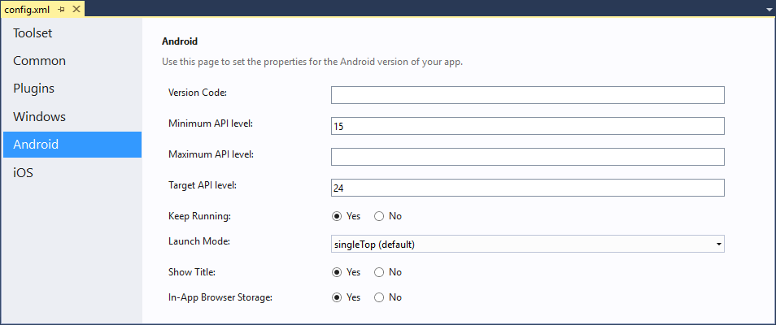

	Each input field on the form corresponds to a specific entry in the project's `config.xml` file:

	+ **Version Code**: `android-versionCode` - a string value, used to set the project's [version code](https://developer.android.com/studio/publish/versioning.html) for the app. See [setting the version code](http://cordova.apache.org/docs/en/latest/guide/platforms/android/index.html#setting-the-version-code) for additional information.
	+ **Minimum API level**: `android-minSdkVersion` - an integer value that represents the minimum device API level for the application. The application will not install on a device if its OS API level is lower than this value.
	+ **Maximum API level**: `android-maxSdkVersion` - an integer value that represents the maximum device API level for the application. The application will not install on a device if its OS API level is higher than this value.
	+ **Target API level**: `android-targetSdkVersion` - an integer value representing the application's [API compatibility](https://developer.android.com/guide/topics/manifest/uses-sdk-element.html).
	+ **Keep Running**: `KeepRunning` - a Boolean value used to determine whether the application stays running in the background after the pause event fires. A `false` value does not kill the app after a pause event, but simply halts execution of code within the Cordova WebView while the app is in the background.
	+ **Launch Mode**: `AndroidLaunchMode` - a string value that sets the Activity `android:launchMode` attribute in the application. This changes what happens when the app is launched from app icon or intent and is already running. Valid values are **standard**, **singleTop**, **singleTask**, and **singleInstance**.
	+ **Show Title**: `ShowTitle` - a Boolean value that controls whether the application displays the app title at the top of the application's main screen.
	+ **In-App Browser Storage**: `InAppBrowserStorageEnabled` - Controls whether pages opened within an InAppBrowser window can access the same localStorage and WebSQL storage as pages opened with the default browser.

	You can read about each configuration option in the Cordova [`config.xml` reference](http://cordova.apache.org/docs/en/latest/config_ref/index.html#preference) guide.

### <a id="android-2"></a> 2. Android: Generate a Private Certificate

When running Android applications using the Android SDK (which Visual Studio uses under the covers), applications are signed with a **debug certificate generated by the Android SDK tools**. Before you can sign Android applications for deployment via other means, you must use a signing certificate for your organization. If you already have a certificate you would like to use to sign your Android applications, feel free to skip the remainder of this section.

> [!NOTE]
> Certificates are stored in a **keystore**, if you already have a keystore on your system you'd like to use to store your certificate, you'll need the keystore location and credentials before you continue. Refer to the [Java documentation](https://docs.oracle.com/javase/6/docs/technotes/tools/windows/keytool.html) for additional information about keystores.

To create a signing certificate, complete the following steps:

1.	Open a Windows Command Prompt.

	> [!NOTE]
	> If your existing keystore is in a protected folder (like `c:\` for example), or you'll be generating a keystore in a protected folder, you'll need to open the command prompt in Administrator mode for these steps to complete successfully.

2.	If your system is configured with the Java SDK `bin` folder on the system `PATH`, then skip to the next step. You can confirm this by typing `javac` in the command window and pressing enter. If you receive an error message, the JDK is **not** on the path. If you see the Java Compiler help page, then you're in good shape and can skip this step.

	In the Command Prompt, change directories to the Java SDK's `bin` folder. If your development system has the `%JAVA_HOME%` environment variable set, then it should be `%JAVA_HOME%\bin`. You can also switch to the SDK folder using the complete path (such as: `C:\Program Files\Java\jdk1.8.0_111\bin`).

3.	In the Command Prompt, execute the following command:

    ```
    keytool -genkeypair -v -keystore FILE-PATH\MY-KEYSTORE-NAME.keystore -alias MY-ALIAS -keyalg RSA -keysize 2048 -validity 10000
    ```

    Replacing `FILE-PATH\MY-KEYSTORE-NAME.keystore` and  `MY-ALIAS` with the appropriate values for your needs. If you have an existing keystore you want to use, substitute your keystore file path for `DRIVE:\FILE-PATH\MY-KEYSTORE-NAME.keystore` in the example

	For example, if you wanted to write the keystore to the system's `dev` folder in a keystore file called `jd-release-key.keystore` and using an alias of `android-key` for the generated key, you would issue the following command:

	```
	keytool -genkeypair -v -keystore c:\dev\jd-release-key.keystore -alias android-key -keyalg RSA -keysize 2048 -validity 10000
	```

	The Java `keytool` application will launch and prompt you for a series of values it needs to create the keystore and generate the keypair:

    ```
	Enter keystore password:
	Re-enter new password:
	What is your first and last name?
  	  [Unknown]:  Joe Developer
	What is the name of your organizational unit?
  	  [Unknown]:  NA
	What is the name of your organization?
  	  [Unknown]:  Company
	What is the name of your City or Locality?
  	  [Unknown]:  Charlotte
	What is the name of your State or Province?
  	  [Unknown]:  NC
	What is the two-letter country code for this unit?
  	  [Unknown]:  US
	Is CN=Joe Developer, OU=NA, O=Company, L=Charlotte, ST=NC, C=US correct?
  	  [no]:  y

	Generating 2,048 bit RSA key pair and self-signed certificate (SHA256withRSA) with a validity of 10,000 days
        for: CN=Joe Developer, OU=NA, O=Company, L=Charlotte, ST=NC, C=US
	Enter key password for <android-key>
        (RETURN if same as keystore password):
	[Storing c:\dev\jd-release-key.keystore]
	```

    If you want more detail about this process, see the Android developer documentation here: [Signing your applications](http://developer.android.com/tools/publishing/app-signing.html).

### <a id="android-3"></a> 3. Android: Modify the Android App Build Configuration

Now that you have a keystore and a signing certificate, you must configure your project to use them.

1.	In **Solution Explorer**, expand the project folder, and double-click on the project's `build.json` file. The `build.json` file opens in the code editor:

    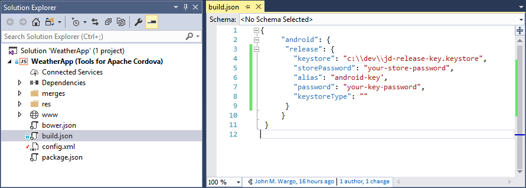

	> [!NOTE]
	> If the `build.json` file is missing from your project, its likely that your project was created with an earlier version of Apache Cordova; you should create that file manually (and populate it with content shown in step 2).

2.	Populate the `build.json` file with the keystore and key details:

	```JavaScript
	{
      "android": {
        "release": {
          "keystore":"c:\\dev\\jd-release-key.keystore",
          "storePassword":"your-store-password",
          "alias":"android-key",
          "password":"your-key-password",
          "keystoreType":""
        }
      }
    }
	```

### <a id="android-4"></a> 4. Android: Create the Deployment Package

The final step involves creating a **Release** build of the Cordova Application.

1.	On the Standard toolbar, choose the **Android** platform.

    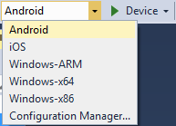

2.	Choose the **Release** build configuration.

    

3.	Choose one of the Android emulators or a physical device.

    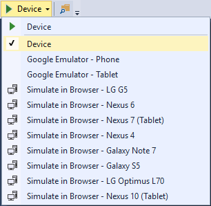

    > [!NOTE]
    > **Do not select** one of the **Simulate in Browser** options, they don't generate a native application binary. Choose only an **Android emulator** or **Device**.

4.	In the **Build** menu, select **Build Solution**. This creates a release build of the application, a file with an `.apk` file extension. This is the file that you'll upload to the store when you deploy the application.

5.	When the build completes, look for the `.apk` file; you'll find it in the project's `bin/Android/Release/` folder. When uploading the app to the app store, be sure to select the file that **does not** include the word `unaligned` in the file name.

    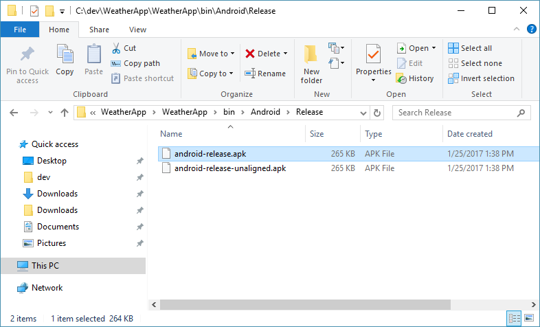

At this point, you have a release version of the application all ready to distributed through the Google Play App Store.

## <a id="ios"></a> iOS Applications

For iOS applications, preparing your environment for publishing, and publishing the app requires that you complete the following steps:

1.	[Request a Distribution Certificate](#ios-1)
4.	[Modify Application Settings](#ios-2)
5.	[Create the Deployment Package](#ios-3)
6.	[Submit Your App to the App Store](#ios-4)

### <a id="ios-1"></a> 1. iOS: Request a Distribution Certificate

Apple uses **Distribution Certificates** to identify a developer, development team, or organization. You'll need a distribution certificate to deploy applications through the Apple App Store. If your team already has one and you want to use it, refer to [*How to share an iOS distribution certificate*](http://www.ironpaper.com/webintel/articles/how-to-share-an-ios-distribution-certificate/). Then, skip straight to the [Modify Application Settings](#ios-2) section of this document.

> [!NOTE]
> Building iOS applications, requesting distribution certificates, and deploying applications to the app store all require the use of Apple's Xcode development environment running on a computer system running [macOS](http://www.apple.com/macos/). You'll also need an active [Apple iOS developer program account](https://developer.apple.com/ios/). Be sure you have the appropriate iOS development environment setup before continuing.

To create a distribution certificate, complete the following steps:

1.	Switch to your Macintosh system and open the Xcode IDE.

2.	In the system's menu, select **Xcode** -> **Preferences**.

	If you haven't done so already, add your developer account Apple ID to the system's configuration. See [Adding an Apple ID to Your Accounts](https://developer.apple.com/library/ios/recipes/xcode_help-accounts_preferences/articles/add_appleid.html) for instructions.

3.	In the **Accounts** section, select your developer account, then click the **View Details** button.

4.	In the account details window, under **Signing identities**, look for the item labeled **iOS Distribution**. If there is a **Create** button to the right the iOS Distribution entry, click the button to create and download the signing identity. If the Create button isn't shown, that means this step has already been completed.

    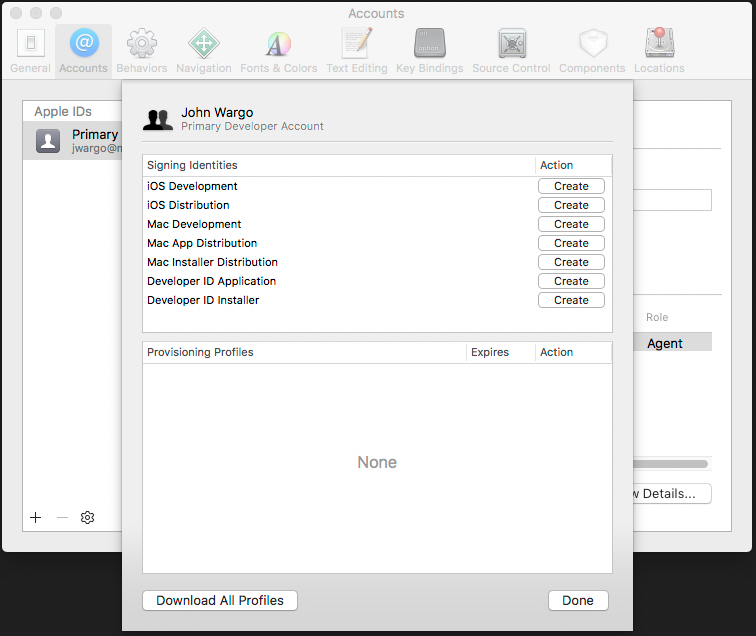

    Looking for more information about signing identities? See [Creating Signing Identities](https://developer.apple.com/library/ios/documentation/IDEs/Conceptual/AppDistributionGuide/MaintainingCertificates/MaintainingCertificates.html#//apple_ref/doc/uid/TP40012582-CH31-SW6) (Optional reading).

	Xcode will submit a request to generate the distribution profile and hide the button you clicked to indicate that the distribution profile exists.

5.	Click the **Done** button to close the account details window.

### <a id="ios-2"></a> 2. iOS: Modify Application Settings

As you prepare to publish your shiny new Cordova application, start in the application's configuration and make sure your settings for the application are correct. A Cordova app's settings are maintained in the project's `config.xml` file.

1.	In the Visual Studio Solution Explorer, double-click the `config.xml` file to open the custom configuration editor shown in the following figure:

	

	The editor's **Common** tab contains general settings for your app; populate the fields in the form with the appropriate values for your application. The critical settings for any Cordova application are:

	+ **Display Name**: the application's public name; this is the how the app will appear in the app store and on the target mobile device's home screen and application listing. Populate this field with a brief word or phrase that describes your app, keeping in mind that app tiles on a device's home screen don't leave much room for text. The value you enter here is added to the `config.xml` in the `<name>` element.

	+ **Package Name**: the unique identifier for this application. Developers typically populate this field with a combination of the developer's company domain in [**reverse domain name notation**](https://en.wikipedia.org/wiki/Reverse_domain_name_notation) plus the short name for the application. The value you provide here is added to the `widget` element's `id` attribute as shown in the following example"

		```xml
		<widget xmlns:cdv="http://cordova.apache.org/ns/1.0" xmlns:vs="http://schemas.microsoft.com/appx/2014/htmlapps" id="com.company.weatherapp" version="1.0.0" xmlns="http://www.w3.org/ns/widgets" defaultlocale="en-US">
		```

	+ **Domain Access**: Manages a list of domains that the application can access; the values you enter here are added as `access` elements to the `config.xml` as shown in the following example:

		```xml
		<access origin="api.openweathermap.org" />
		```

	The purpose of most other settings clear from the title, but you can find more information about them here: [The config.xml File](http://cordova.apache.org/docs/en/latest/config_ref/index.html).

2.	Switch to the **iOS** tab to set application settings specific to the iOS platform. Populate the fields on the form using the appropriate values for your application:

	+ **Target Device**: Used to specify the type of device the application targets; valid options are: **handset**, **tablet**, and **universal**.

	+ **Target iOS Version**: Sets the `MinimumOSVersion` in the generated `.ipa` file. For more information on this setting, refer to [*Configuring a Project for SDK-Based Development]*(https://developer.apple.com/library/content/documentation/DeveloperTools/Conceptual/cross_development/Configuring/configuring.html).

	+ **Web Storage Backup**: Used to specify how iOS backs up application data stored using web storage. Available options are: **none**, **local**, or **cloud**. The cloud option backs up application data using iCloud. The local option enables local backups via iTunes sync. The none option disables storage backup.

	+ **Suppress Incremental Rendering**: When set to `true`, screen rendering is delayed until all content has been received.

    

3.	Even though Xcode manages provisioning and signing, you won't be opening Xcode to configure it for your project, this is all handled behind the scenes by Visual Studio TACO. Instead, you'll configure your **iOS Developer credentials** using the Cordova project's `build.json` file. During the build process, the Cordova CLI (invoked by Visual Studio TACO) copies settings for the iOS build from the `build.json` file to the Xcode project's configuration. Next, the `remotebuild` process (described in detail in the TACO [iOS Setup Guide](https://taco.visualstudio.com/en-us/docs/vs-taco-2017-ios-guide/)) executes the Xcode command-line tools to build and sign the app using the settings you provided.

	To configure the iOS build process, you only need one piece of information, the Team ID for your Apple Developer program account. Open your browser of choice and navigate to [https://developer.apple.com/account](https://developer.apple.com/account). After you've authenticated to the site, open the **Membership** page shown in the following figure. Note the Team ID from the page (it will be a series of letters and numbers, **not** `MyTeamID` as shown in the figure).

	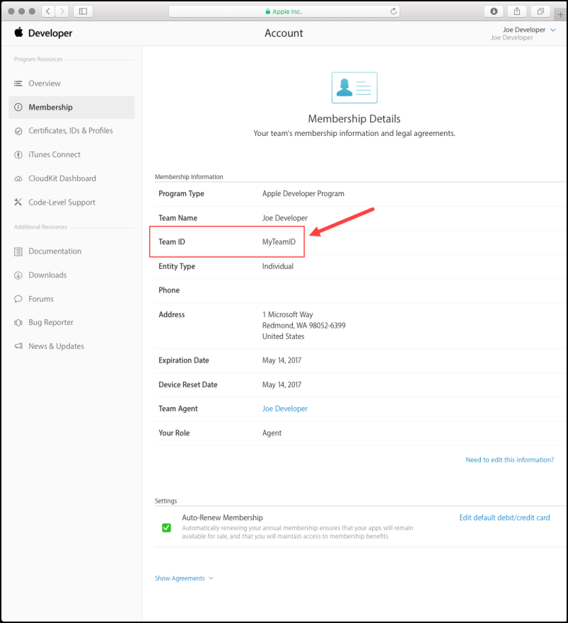

	Next, open the Cordova project's `build.json` file, and add the following JSON object to the file, replacing `MyTeamID` with the correct value for your account:

	```json
	"ios": {
	  "debug": {
	    "developmentTeam": "MyTeamID"
	  },
	  "release": {
	    "developmentTeam": "MyTeamID",
	    "codeSignIdentity": "iPhone Developer",
	    "packageType": "ad-hoc"
	  }
	}
	```

	Leave `codeSignIdentity` and `packageType` alone as those values are already set as needed. The data you'll be adding must coencide with the Android project settings that are probably already in the file. The resulting JSON object should look something like the following:

	```json
	{
	  "android": {
        "release": {
          "keystore":"c:\\dev\\jd-release-key.keystore",
          "storePassword":"your-store-password",
          "alias":"android-key",
          "password":"your-key-password",
          "keystoreType":""
        }
      },
	  "ios": {
	    "debug": {
	      "developmentTeam": "MyTeamID"
	    },
	    "release": {
	      "developmentTeam": "MyTeamID",
	      "codeSignIdentity": "iPhone Developer",
	      "packageType": "ad-hoc"
	    }
	  }
	}
	```

	> [!NOTE]
	> Don't forget to include the comma between the `android` and `ios` objects.

### <a id="ios-3"></a> 3. iOS: Create the Deployment Package

At this point, you're all ready to build the app to generate the package that you will submit to the app store for distribution.

1. On your Macintosh system, make sure that the remote agent is running. Refer to the TACO [iOS Setup Guide](https://taco.visualstudio.com/en-us/docs/vs-taco-2017-ios-guide/) for details.

2.	With the Cordova project open in Visual Studio, on the Standard toolbar, choose the **iOS** platform.

    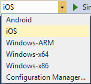

3.	Choose the **Release** build configuration.

    

4. For execution target, select **Remote Device**.

    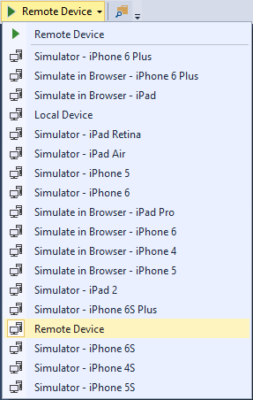

5. On the **Build** menu, choose **Build Solution**.

    This starts a build on the remotebuild agent and uses the distribution certificate and a newly generated provisioning profile to build a release signed iOS Application Archive (.ipa) file. You can find the resulting file in the `bin/iOS/Release` folder of your project.

	

### <a id="ios-4"></a> 4. iOS: Submit Your App to the App Store

1.	Copy the application files onto a folder on your Mac.

2.	Follow Apple's procedures for submitting the app to the App Store.

## <a id="windows"></a> Windows Applications

First, decide which platforms and device families you want to make your app available to. It doesn't matter which version of Windows the app targets. The Windows store accepts all of them. That said, the operating system of a device or PC only runs apps that target the same version of that operating system or an earlier version. To learn more about Windows package and Windows device compatibility, see [OS versions and package distribution](https://msdn.microsoft.com/library/windows/apps/mt188601.aspx#os).

Complete the following steps to package and deploy Windows applications:

+	[Modify App Settings](#windows-1)
+	[Package the App](#windows-2)
+	[Submit Your App to the App Store](#publish-windows)

### <a id="windows-1"></a> Modify App Settings

As you prepare to publish your shiny new Cordova application, start in the application's configuration and make sure your settings for the application are correct. A Cordova app's settings are maintained in the project's `config.xml` file.

1.	In the Visual Studio Solution Explorer, double-click the `config.xml` file to open the custom configuration editor shown in the following figure:

	

	The editor's **Common** tab contains general settings for your app; populate the fields in the form with the appropriate values for your application. The critical settings for any Cordova application are:

	+ **Display Name**: the application's public name; this is the how the app will appear in the app store and on the target mobile device's home screen and application listing. Populate this field with a brief word or phrase that describes your app, keeping in mind that app tiles on a device's home screen don't leave much room for text. The value you enter here is added to the `config.xml` in the `<name>` element.

	+ **Package Name**: the unique identifier for this application. Developers typically populate this field with a combination of the developer's company domain in [**reverse domain name notation**](https://en.wikipedia.org/wiki/Reverse_domain_name_notation) plus the short name for the application. The value you provide here is added to the `widget` element's `id` attribute as shown in the following example"

		```xml
		<widget xmlns:cdv="http://cordova.apache.org/ns/1.0" xmlns:vs="http://schemas.microsoft.com/appx/2014/htmlapps" id="com.company.weatherapp" version="1.0.0" xmlns="http://www.w3.org/ns/widgets" defaultlocale="en-US">
		```

	+ **Domain Access**: Manages a list of domains that the application can access; the values you enter here are added as `access` elements to the `config.xml` as shown in the following example:

		```xml
		<access origin="api.openweathermap.org" />
		```

	The purpose of most other settings clear from the title, but you can find more information about them here: [The config.xml File](http://cordova.apache.org/docs/en/latest/config_ref/index.html).

2.	Windows-specific settings appear in the **Windows** tab of the configuration designer.

	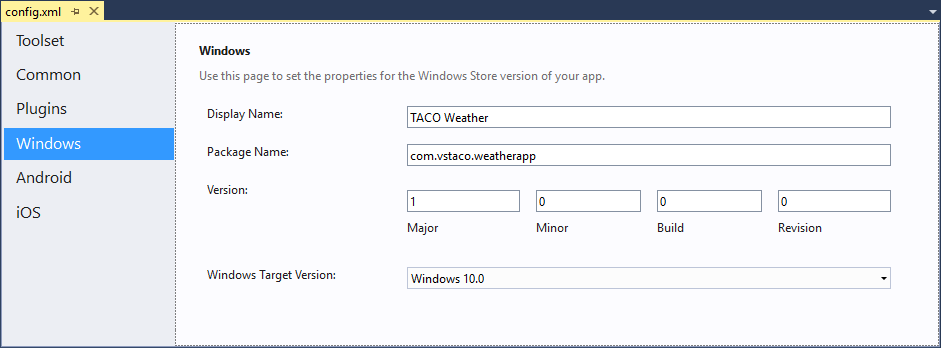

	You might have noticed that the this page shares three of the same field names as the **Common** page (**Display Name**, **Package Name**, and **Version**). In the **Create App Package Wizard** (which you'll use later) you might have to choose a different display name or package name because of Windows-specific naming requirements, the name has already been reserved by someone else, or if you want to associate your app with a name that you've previously reserved. Visual Studio will update the **Windows** page's **Display Name** and **Package Name** fields once you've completed the packaging process. That way your other platform targets are not forced to use those names.

	The **Version** field is here because Windows uses a 4 digit version number rather than Cordova's standard 3 digit one. You can either modify this field directly or let Visual Studio set this field based on the version number that you choose in the packaging wizard.

	The **Windows Target Version** field only supports one option today, so you can ignore it.

### <a id="windows-2"></a> Package The Application

1.	In Visual Studio's Standard Toolbar, select the appropriate **Windows** target based on the target device processor: **Windows-ARM** for ARM devices, and **Windows-x64** or **Windows-x86** for Intel type processors.

    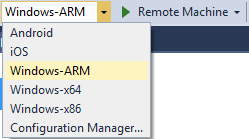

2.	Choose **Project** -> **Store** -> **Create App Packages** to start the packaging wizard. For step-by-step guidance on the packaging process, see [Create an app package](https://msdn.microsoft.com/en-us/library/windows/apps/xaml/mt627715.aspx#create_package).

    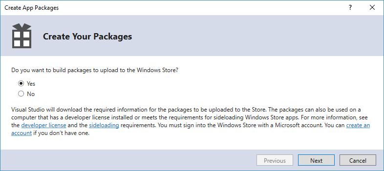

3.	The packaged application will be deployed to the target folder you selected in the **Output location** in packaging wizard. By default, it will use the `AppPackages` folder in the root of your project.

4.	[Install your Windows app onto a device or publish it to the store](#publish-windows).

### <a id="publish-windows"></a>Install your Windows app onto a device or publish it to the store

To publish your app to the store, see [Publish Windows apps](https://dev.windows.com/en-us/publish).

To install your app directly onto a device [Sideload your app package](https://msdn.microsoft.com/en-us/library/windows/apps/xaml/mt627715.aspx#sideload_package).
