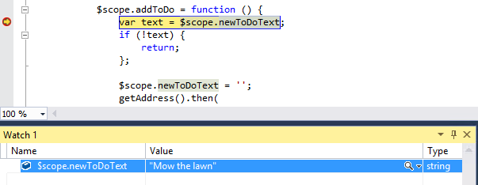
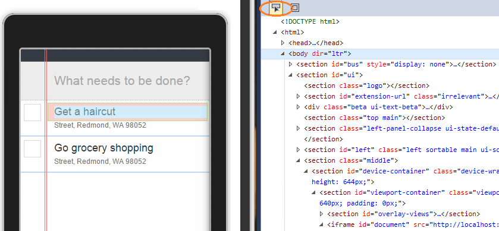
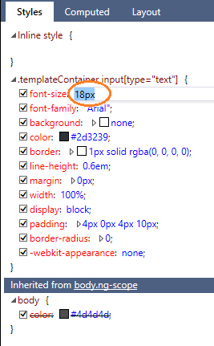
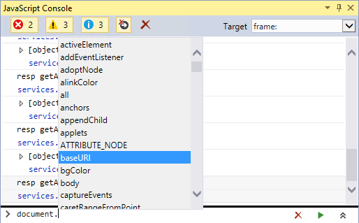
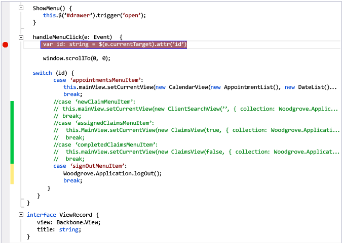
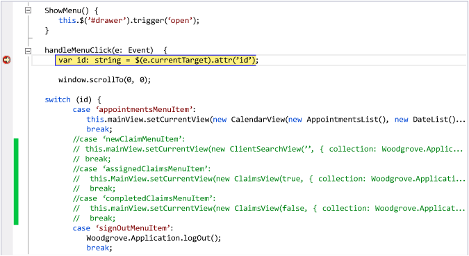
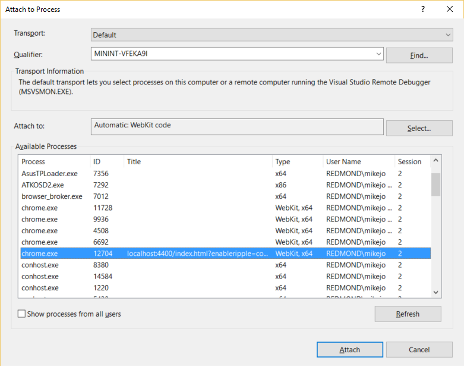
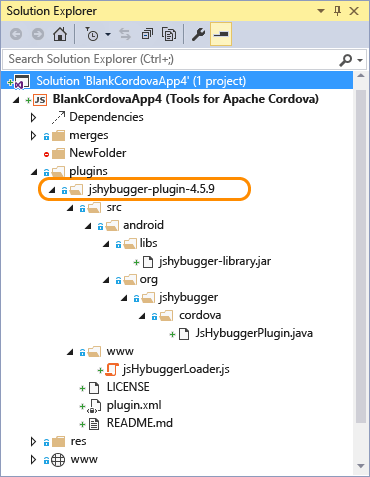

<properties
   pageTitle="Debug your app built with Visual Studio Tools for Apache Cordova | Cordova"
   description="description"
   services="na"
   documentationCenter=""
   authors="Chuxel"
   tags=""/>
<tags ms.technology="cordova" ms.prod="visual-studio-dev14"
   ms.service="na"
   ms.devlang="javascript"
   ms.topic="article"
   ms.tgt_pltfrm="mobile-multiple"
   ms.workload="na"
   ms.date="07/25/2016"
   ms.author="clantz"/>
# Debug your app built with Visual Studio Tools for Apache Cordova

Visual Studio brings a seamless and common tooling experience for developing Cordova apps across app types and device platforms. When developing Apache Cordova apps, you can use diagnostic tools such as the Visual Studio debugger, the DOM Explorer, and the JavaScript Console to fix problems in your apps. For platform-specific differences in the debugger experience, see [Debugging features by platform](#Debugging features by platform).

This article matches the steps of the Cordova [Video tutorial](http://go.microsoft.com/fwlink/p/?LinkID=534729) on debugging. The steps match video content that follows the introduction of the tools and features (approximately four minutes from the start).  If you want steps to debug for a particular platform, see [Debugging features by platform](#Debugging features by platform). 

### Fix build and deployment errors

See these [troubleshooting tips](../tips-workarounds/general-tips.md).

### Use the diagnostic tools

To use Visual Studio to debug your Cordova apps, you must:

1.  [Install Visual Studio 2015](http://go.microsoft.com/fwlink/p/?LinkId=397606) with Visual Studio Tools for Apache Cordova.

2.  If you want to follow the steps in this tutorial, download the [AngularJS ToDoList sample](https://github.com/Microsoft/cordova-samples/tree/master/todo-angularjs), unzip it, and open the solution (.sln file) in Visual Studio.

    You don't need the AngularJS sample to debug, of course, but we are using it in the first example.

### To use the diagnostic tools

1.  With the AngularJS ToDoList sample app open in Visual Studio, choose Android in the **Solution Platforms** list.

2.  Choose **Ripple Nexus (Galaxy)** as a debug target.

3.  Press F5 to start the debugger.

4.  When the ToDoList app loads in Ripple, add another task item to verify that the app is working correctly.

5.  In controllers.js, add a breakpoint to `var text = $scope.newToDoText;` in the `addToDo` function by clicking in the gray left margin.

	```javascript
$scope.addToDo = function () {
    var text = $scope.newToDoText;
    if (!text) {
    return;
};
```

    With the breakpoint added, the editor looks like this.

    

6. In the running app, add another ToDoList task item.

    Now, when you enter the item, the debugger breaks into your code.

    

    From here, you can:

    *   Mouse over variables to see their current value (see preceding illustration).

    *   Press F10 to step over code, allowing you to check updated values.

    *   Open the shortcut menu for a selected variable and choose **Add Watch**.

        The selected variable appears in the Watch window, giving you a great way view multiple variables and their values while they change as you step through code.

        
    *   Use the Locals and Call Stack windows to find more information about the state of the app while you debug.

7. While your app is running, select the [DOM Explorer](https://msdn.microsoft.com/library/hh441474.aspx) tab.

    On the left of the DOM Explorer, you have a view of the live DOM.

    If your app is running and you can't see the DOM Explorer, choose **Debug**, **Windows**, **DOM Explorer**, and then choose the start page of your app.

8. In DOM Explorer, choose the **Select Element** button and select something, like a list item, in the Ripple emulator.

    

    When you select the element, the corresponding element is highlighted in the DOM Explorer.

    On the right, you have the CSS property values for the currently selected element.

    *   The Styles tab shows the CSS styles associated with the element with styles organized by CSS selector name.

    *   The Computed tab shows real-time CSS style property values for the element.

    *   The Layout tab shows the box model for the element.

    You can make changes to your UI right here in DOM Explorer (in the live DOM view, Styles, and Layout tabs), and see the changes immediately reflected in your running app. This makes the UI easier to debug.

    For example, you could edit the font size for a list item (an **input** element) in the Styles tab.

    

9.  Select an element such as the location under a ToDo list item (an **h3** element) and edit the value.

    Your changes will appear in the app in the Ripple emulator.

    Another critical tool to help debug Cordova apps is the JavaScript Console. You can also use the JavaScript Console window to read errors and messages sent from your running app, and also to evaluate lines of JavaScript code that run within the current script context.
10. Look at the output in the JavaScript Console window to view messages.

	> [!NOTE]
    > For a list of commands such as `console.log`, see [JavaScript Console commands](https://msdn.microsoft.com/library/hh696634.aspx)

11.  To evaluate JavaScript, type JavaScript code in the input box. For example, type "document." and you will see IntelliSense information for the document object for the current HTML page displayed in Ripple (Chrome).

    

    You can run code by pressing Enter (single-line mode) or by choosing the green arrow button (multi-line mode).

12.  Press Enter to see the value of the document object in the console window.

	> [!TIP]
    > Set breakpoints in your code to get your app into the desired state, and then use the JavaScript Console to check variables and evaluate code.


## Debugging features by platform

Visual Studio debugger and diagnostic capabilities and their platform-specific differences, are shown in the following table.

<style>
    table, th, td {
        border: 1px solid black;
        border-collapse: collapse;
    }
    th, td {
        padding: 5px;
    }
</style>
<table>
	<thead>
		<tr>
			<th>Device or operating system</th>
			<th>Visual Studio debugger supported?</th>
			<th>Console messages supported?</th>
			<th>Workaround</th>
		</tr>
	</thead>
	<tbody>
		<tr>
			<td>Android 4.4 or later</td>
			<td>Yes</td>
			<td>Yes</td>
			<td>-</td>
		</tr>
		<tr>
			<td>Android versions 2.3.3 to 4.3</td>
			<td>No</td>
			<td>Yes</td>
			<td>For debugger support, see [information about jsHybugger](#DbgAndroid) later in this article.</td>
		</tr>
		<tr>
			<td>iOS 6, 7, 8</td>
			<td>Yes</td>
			<td>Yes</td>
			<td>-</td>
		</tr>
    <tr>
      <td>8.1(Store), Windows Phone 8.1, Windows 10</td>
      <td>Yes</td>
      <td>Yes</td>
      <td>-</td>
    </tr>
    <tr>
      <td>Windows Phone 8</td>
      <td>No</td>
      <td>No (use the Console plugin)</td>
      <td>Use Web Inspector Remote (weinre) or the Console plugin. See [Debug Windows 8 and Windows Phone 8](#DbgWindows) later in this article.</td>
    </tr>
	</tbody>
</table>

> [!NOTE]
> If you are using Windows 7, you can develop apps for Android and iOS, but not for Windows or Windows Phone. To run the app on Windows Server 2012 R2, you must enable the **Desktop Experience** option.

In this section:

* [Debug Android and iOS in Apache Ripple](#DbgRipple)

* [Debug Android on the emulator or a device](#DbgAndroid)

* [Debug iOS on the emulator or a device](#DbgIOS)

* [Debug Windows and Windows Phone](#DbgWindows)


You can attach the Visual Studio debugger to an app that’s running in the Apache Ripple emulator.

### <a name="DbgRipple"></a>To debug in Ripple

1.  With your app open in Visual Studio, choose **iOS** or **Android** from the **Solution Platforms** list, and choose one of the deployment targets that specify the Ripple Emulator.

2.  Press F5.

    You can hit breakpoints set in your code, use the DOM Explorer to inspect HTML and CSS, and interact with your page using the JavaScript Console.

    The following illustration shows a breakpoint set in the Code Editor.

    

    Here, the Visual Studio debugger hits the breakpoint while debugging in the Ripple emulator.

    

    >**Important**: The Visual Studio debugger won’t stop at breakpoints that are hit before the first page loads in Ripple. However, the debugger will stop at these breakpoints after you refresh the browser.

The following cross-platform [JavaScript Console commands](https://msdn.microsoft.com/library/hh696634.aspx) are currently supported from Ripple:

* **$**
* **$$**
* **$0-$4**
* **$_**
* **clear**
* **console.assert**
* **console.clear**
* **console.count**
* **console.debug**
* **console.dir**
* **console.dirxml**
* **console.error**
* **console.group**
* **console.groupCollapsed**
* **console.groupEnd**
* **console.info**
* **console.log**
* **console.time**
* **console.timeEnd**
* **console.warn**
* **dir**

The supported set of console commands, and their behavior, is provided by the host browser, not by Visual Studio. For additional commands that may be supported by Ripple, see the browser documentation for Chrome.

> [!TIP]
> The JavaScript Console in Visual Studio provides IntelliSense information to make easy to identify these commands and other objects on your page.

The DOM Explorer enables debugging of HTML and CSS. Features available in the **Styles**, **Computed**, and **Layout** tabs of the [Quickstart: Debug HTML and CSS](https://msdn.microsoft.com/library/hh441474.aspx) are supported on Ripple.

You can attach the Visual Studio debugger to the Android emulator or to an Android device to debug your app on Android 4.4.

If you’re using an Android version between 2.3.3 and 4.3, you can install the jsHybugger plugin to enable Android diagnostics (DOM Explorer, console, and debugging). This plugin instruments your code locally to enable remote debugging on Android devices and emulators, and supports Android 2.3.3 and later versions.

### <a name="attacheDbgRipple"></a>To attach the debugger to Ripple

If the debugger is not attaching to Ripple when you press F5, you can attach the debugger after your app loads.

1. Select Ripple as your target and start the app by pressing F5 and wait for the app to load.

2. Choose **Debug** > **Attach to Process**, and then choose the chrome.exe process with a title of `localhost:<Ripple port number>`.

    

3. Refresh Chrome.

    You should now hit breakpoints and be able to use the JavaScript Console and the DOM Explorer.

### <a name="DbgAndroid"></a>To debug on Android 4.4

1.  With your project open in Visual Studio, choose **Android** from the **Solution Platforms** list, and choose one of the Android deployment targets.

2.  Press F5.

    If you are using Android 4.4, you can hit breakpoints set in your code, interact with your page using the JavaScript Console, and use the DOM Explorer.

    >**Important**: The Visual Studio debugger won’t stop at breakpoints that are hit before the first page loads in Android 4.4 emulators or in Android devices. However, the debugger will stop at these breakpoints after you execute the following command from the JavaScript Console: `window.location.reload()`

### To debug on Android versions 2.3.3-4.3 with the jsHybugger plugin

1.  Open your Cordova project in Visual Studio.

2.  In your project, create a **plugins** folder if one doesn’t already exist. (To add a folder, open the shortcut menu for your project in Solution Explorer, choose **Add**, **New Folder**, and then set the folder name to **plugins**.)

3.   [Download the jsHybugger plugin](https://www.jshybugger.com/download?release=Plugin) and extract its contents.

    > [!NOTE]
    > For more information about this plugin, see the [jsHybugger website](https://www.jshybugger.com/). You can use the plugin without a license, but debugging sessions are limited to two minutes. For unlimited debugging, you must [purchase a jshybugger license](https://www.jshybugger.com/#!/buy). The following instructions assume that you’ve purchased a license and downloaded the license file as jshybugger_license.xml.

1.  Place the unzipped jshybugger-plugin-**x.x.x** folder in your project’s **plugins** folder.

2.  Place the jshybugger_license.xml file in the root of your project.

    Here’s what your project will look like in Solution Explorer.

    
3.  In your project, choose **Android** from the **Solution Platforms** list, and then choose one of the Android deployment targets.

4.  Press F5 to start debugging.

    You can interact with your page using the JavaScript Console, and use the DOM Explorer to inspect HTML and CSS.

    >**Important**: You must remove the jsHybugger plugin and the license file from your project before you publish your app.

The plugin has no effect when you’re using the Apache Ripple emulator or debugging on Android 4.4 emulators and devices, so there’s no need to remove it when you switch between different Android targets during testing.

The following cross-platform [JavaScript Console commands](https://msdn.microsoft.com/library/hh696634.aspx) are currently supported for Android:

* **$**
* **$$**
* **$0-$4**
* **$_**
* **clear**
* **console.assert**
* **console.clear**
* **console.count**
* **console.debug**
* **console.dir**
* **console.dirxml**
* **console.error**
* **console.group**
* **console.groupCollapsed**
* **console.groupEnd**
* **console.info**
* **console.log**
* **console.time**
* **console.timeEnd**
* **console.warn**
* **dir**

The supported set of console commands, and their behavior, is provided by the host browser, not by Visual Studio. For additional commands that may be supported by Android, see the browser documentation for Chrome for Android.

> ![TIP]
> The JavaScript Console in Visual Studio provides IntelliSense information to make easy to identify these commands and other objects on your page.

Features available in the **Styles**, **Computed**, and **Layout** tabs of the [Quickstart: Debug HTML and CSS](https://msdn.microsoft.com/library/hh441474.aspx) are supported on Android.

You can attach the Visual Studio debugger to the iOS Simulator or to an iOS device. iOS 6, 7, and 8 are supported.

> [!NOTE]
> Currently, attaching the debugger to iOS apps that use the InAppBrowser plugin is not supported. The Azure Mobile Services plugin uses the InAppBrowser plugin and is affected by this limitation.

### <a name="DbgIOS"></a>To debug on iOS

1.  Make sure you have [installed the remote agent](../getting-started/install-vs-tools-apache-cordova.md#ios) on your Mac, started the agent, and configured Visual Studio to connect to the agent.

2.  If you are debugging on an actual device, go to your device and choose **Settings**, **Safari**, **Advanced**, and then enable Web Inspector.

    This allows remote debugging on your device. (This step is not required to debug on the iOS Simulator.)

3.  With your app open in Visual Studio and iOS selected in the **Solution Platforms** list, choose a deployment target.

    To debug for a device connected to the remote agent on your Mac, choose **Remote Device** as your deployment target. For a device connected to your PC, choose **Local Device**.

4.  Press F5.

    You can hit breakpoints set in your code, interact with your page using the JavaScript Console, and use the DOM Explorer to inspect HTML and CSS.

    >**Important**: The Visual Studio debugger won’t stop at breakpoints that are hit before the first page loads in the iOS Simulator or on iOS devices. However, the debugger will stop at these breakpoints after you execute the following command from the JavaScript Console: `window.location.reload()`

The following cross-platform [JavaScript Console commands](https://msdn.microsoft.com/library/hh696634.aspx) are currently supported for iOS:

* **$**
* **$$**
* **$0-$4**
* **$_**
* **clear**
* **console.assert**
* **console.clear**
* **console.count**
* **console.debug**
* **console.dir**
* **console.dirxml**
* **console.error**
* **console.group**
* **console.groupCollapsed**
* **console.groupEnd**
* **console.info**
* **console.log**
* **console.time**
* **console.timeEnd**
* **console.warn**
* **dir**

The supported set of console commands, and their behavior, is provided by the host browser, not by Visual Studio. For additional commands that may be supported by iOS, see the browser documentation for iOS Safari.

> [!TIP]
> The JavaScript Console in Visual Studio provides IntelliSense information to make easy to identify these commands and other objects on your page.

Features available in the **Styles**, **Computed**, and **Layout** tabs of the [Quickstart: Debug HTML and CSS](https://msdn.microsoft.com/library/hh441474.aspx)  are supported on iOS.

> [!WARNING]
> We’ll continue to improve debugging support in subsequent releases. For detailed information about debugging support, see [Known Issues](http://go.microsoft.com/fwlink/?linkid=398782).

### <a name="DbgWindows"></a>To debug in Windows and Windows Phone
For Windows 8, Windows 8.1, and Windows Phone 8.1 apps, you can use the same Visual Studio debugging tools that you would use for any Windows Store app built using HTML and JavaScript. For more information, see [Debug Store apps in Visual Studio](https://msdn.microsoft.com/library/hh441472.aspx) in the Windows Dev Center.

For Windows Phone 8 apps, you cannot attach the Visual Studio debugger. Instead, you can use Web Inspector Remote ([weinre](http://people.apache.org/~pmuellr/weinre/docs/latest/)), which is described in a [Microsoft Open Technologies blog post](http://msopentech.com/blog/2013/05/31/now-on-ie-and-firefox-debug-your-mobile-html5-page-remotely-with-weinre-web-inspector-remote/).

As an alternative to using weinre for Windows Phone 8 debugging, you can instead add the Console plugin to your app, build your app, and then open the generated native Windows Phone 8 project in Visual Studio. The native project can be found under the platforms\wp8 folder. With the native project open, you can use the Output window to view console output. For more information about accessing the native projects, see [Access a Native Cordova Project](../tips-workarounds/access-native-cordova-project.md).

> [!WARNING]
> Changes you make to the native project will be overwritten when you rebuild the Cordova app.

 [Get the Visual Studio Tools for Apache Cordova](http://aka.ms/mchm38) or [learn more](https://www.visualstudio.com/cordova-vs.aspx)
