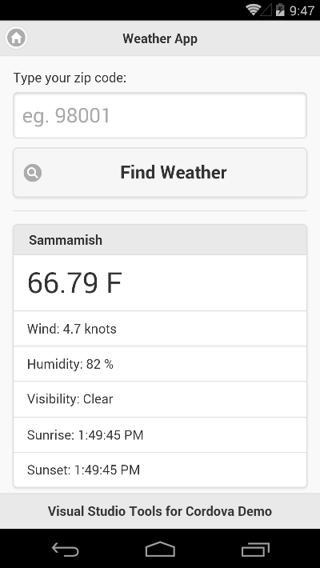

# Prerequisites

This tutorial has a few requirements that you need to fulfill before continuing:

- Verify your Android SDK and environment variables
- Run the test app in the Google Android Emulator
- Update Node.js
- Create a bit of initial test code and execute in Node.js.

> [!NOTE]
> All the sample files for this tutorial are found in the [ui-testing folder of the Cordova samples repository](https://github.com/Microsoft/cordova-samples/tree/master/ui-testing). Once you've created a local copy, run *npm install* to install everything referenced in package.json.

## Verify your Android SDK and environment variables

First make sure the Android SDK for API level 19 is installed, because it’s the configuration we’ll be using.

Then check that you have the necessary environment variables set as described in the following table.

<table>
<thead>
<tr>
<td>Variable</td><td>Location/Description</td>
</tr>
</thead>
<tbody>
<tr>
<td>ANDROID_SDK_HOME</td><td>Must point to the Android SDK folder. The Android SDK installer sets this automatically, including when it’s run as part of Visual Studio setup.</td>
</tr>
<tr>
<td>ANDROID_HOME</td><td>Set to the same location as ANDROID_SDK_HOME. This variable is typically not set by installers.</td>
</tr>
<tr>
<td>JAVA_HOME</td><td>Must point to the Java JDK location, such as <em>C:\Program Files (x86)\Java\jdk1.7.0_55</em>.</td>
</tr>
<tr>
<td>PATH</td><td>Must include <em>%ANDROID_HOME%\tools;%ANDROID_HOME%\platform-tools;</em></td>
</tr>
<tbody>
</table>

##Update Node.js

Make sure you have a current version of Node.js installed—we’ll need it for certain features in our test code. The easiest way is to just use the following command from a command prompt:

    npm install –g node

You can check the version as follows:

    node –version

Version 4.4.3 is suitable for this tutorial.

##Run the test app in the emulator

To learn how to write and run UI tests for Apache Cordova apps, we need an app to test. For this we’ll use the simple WeatherApp sample from [https://github.com/Microsoft/cordova-samples/tree/master/weather-app](https://github.com/Microsoft/cordova-samples/tree/master/weather-app):

1.	Download the ZIP of the samples from [https://github.com/Microsoft/cordova-samples](https://github.com/Microsoft/cordova-samples) or clone the repository locally.

2.	Open weather-app/WeatherApp.sln in Visual Studio.

3.	To run the app you’ll need a free API key from [http://openweathermap.org/](http://openweathermap.org/). Specific instructions for this can be found on [Getting Started with Visual Studio Tools for Apache Cordova](../first-steps/build-your-first-app.md), which is the walkthrough for building the app.

4. Open weather.js and paste your API key as the value for the *OpenWeatherAppKey* variable.

5. Build the app to check that your Visual Studio environment is current. A successful build will produce an app package under *bin\Android\Debug\android-debug.apk*. Note that you might need to update the Tools for Apache Cordova by going to **Tools > Extensions and Updates…** and checking the **Updates** node.

6. Select the Google Android Emulator as a debug target in Visual Studio and launch the app. It should appear as below. When you're finished, stop the app in Visual Studio but leave the emulator running, as we’ll be using it throughout the course of our UI testing.

##Verify WebDriver operation

The test code we’ll eventually write uses the Appium WebDriver client library for Node.js, known as **[wd](https://github.com/admc/wd)**. In this section, we’ll write some simple code to make sure we have this library installed correctly.

At a command prompt, create a folder for your tests (this can be anywhere), switch to that folder, and run the following command:

    npm install wd

Next, let’s create an initial test file to verify that **wd** is available. Create a file named [**test00.js**](https://github.com/Microsoft/cordova-samples/blob/master/ui-testing/test00.js) (because it’s not much of a test!) with the following contents:

    var wd = require("wd");
    var appDriver = wd.remote({
        hostname: '127.0.0.1',
        port: 4723,
    })

    // Some debug output to show default configurations
    console.log("appDriver.configUrl.host: " + appDriver.configUrl.host);

    for (var property in appDriver.defaultCapabilities) {
        console.log("appDriver.defaultCapabilities." + property + ": " +
            appDriver.defaultCapabilities[property]);
    }

Then run it with Node.js:

    node test00.js

Even though we haven’t set up and started the Appium server yet, the **wd** library will nevertheless initialize an object to manage the connection and set some default “capabilities” as shown in the output below. Note that the code specifies 127.0.0.1:4723 specifically because that’s a common default for using Appium on Windows:

    appDriver.configUrl.host: 127.0.0.1:4723
    appDriver.defaultCapabilities.browserName: firefox
    appDriver.defaultCapabilities.version:
    appDriver.defaultCapabilities.javascriptEnabled: true
    appDriver.defaultCapabilities.platform: ANY

These capabilities contain a variety of values that describe a specific testing environment. As you can imagine, using a Firefox browser on an unspecified platform probably won’t cut it for Cordova apps. We’ll see how to do this shortly, but first we need to get the Appium server going as described in the next section.
