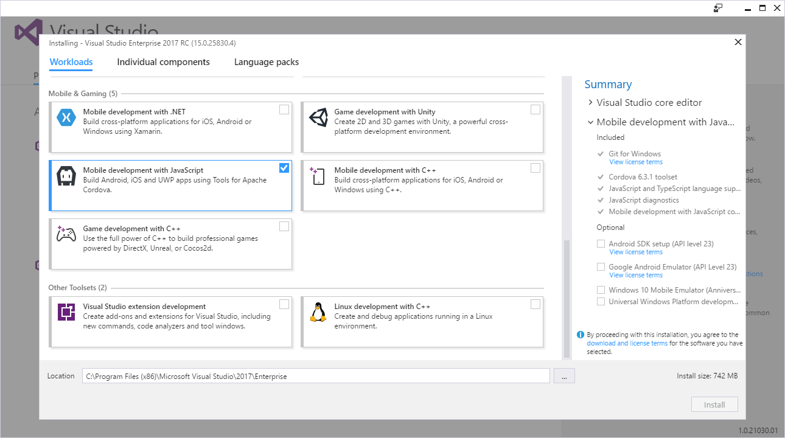
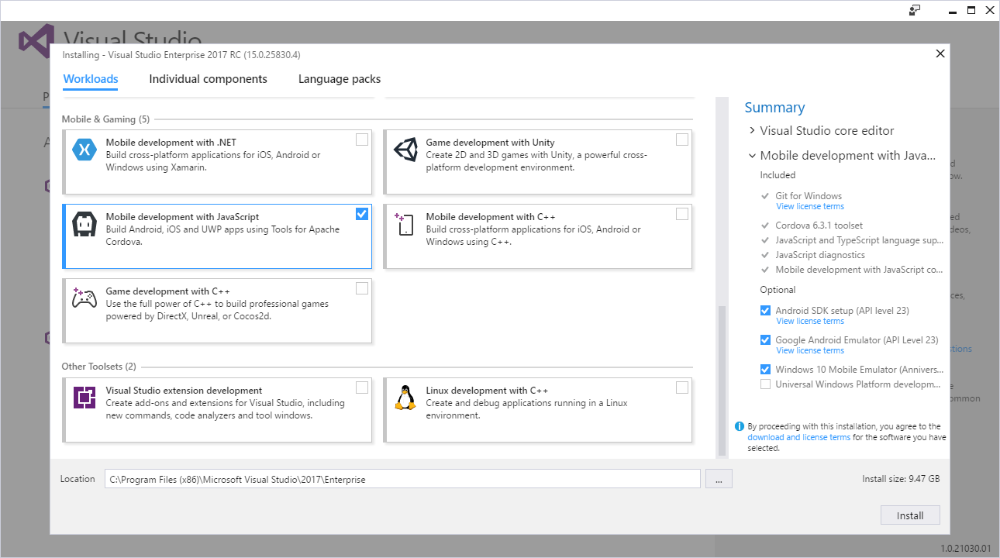
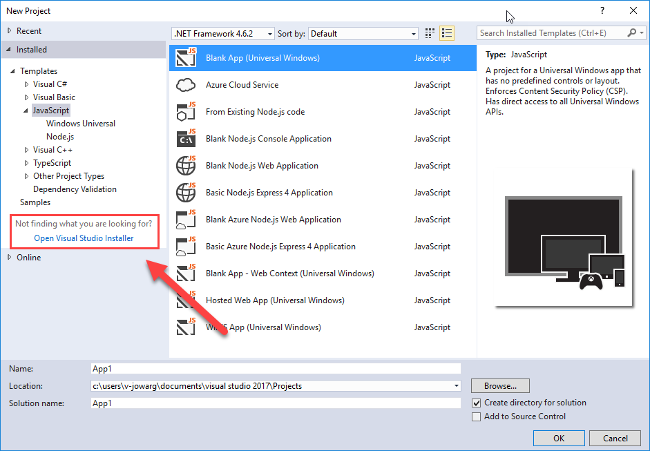

<properties
   pageTitle="Installing Visual Studio Tools for Apache Cordova | Cordova"
   description="Installing Visual Studio Tools for Apache Cordova"
   services="na"
   documentationCenter=""
   authors="normesta, johnwargo"
   tags=""/>
<tags ms.technology="cordova" ms.prod="visual-studio-dev15"
   ms.service="na"
   ms.devlang="javascript"
   ms.topic="article"
   ms.tgt_pltfrm="mobile-multiple"
   ms.workload="na"
   ms.date="10/28/2016"
   ms.author="johnwargo"/>

# Installing Visual Studio Tools for Apache Cordova

Visual Studio Tools for Apache Cordova is a workload for Visual Studio that enables developers to create, manage and test application projects for [Apache Cordova](https://cordova.apache.org/) on Android, iOS, and Windows. The Tools allow developers to deploy, test and debug Cordova applications on devices, emulators, simulators and the chrome browser -- all within Visual Studio. 

This guide covers the required steps to install Visual Studio Tools for Apache Cordova. Since the workload interacts with several mobile app development SDKs, and each relies upon a specific set of tools, the installation will download and install a variety of software components and consume a lot of disk space. Additionally, in order for Visual Studio to work with applications for iOS, you'll need access to a fully functional iOS development environment (which means Xcode running on a Macintosh computer).

## System Requirements

Start by ensuring your development system meets the [minimum system requirements for Visual Studio](https://www.visualstudio.com/en-us/productinfo/vs2017-system-requirements-vs). Apache Cordova app development adds the following system requirements:

+ To test and debug Cordova apps using [Cordova Simulate](simulate-in-browser.md) requires installation of the [Google Chrome Browser](https://www.google.com/chrome/).
+ To test and debug Android apps using the higher-performance emulator (Android Emulator 2.0), you must disable Hyper-V, and install Intel's Hardware Accelerated Execution Manager (HAXM). HAXM is installed automatically when you install an Intel-based Android emulator through the Android SDK Manager.
+ To test and debug iOS apps through Visual Studio requires access to a Macintosh computer with Xcode, Apache Cordova and the Visual Studio remotebuild module installed.
+ Universal Windows app development for all target platforms requires that Visual Studio is installed on Windows 10. Older versions of Windows are not compatible.
+ Universal Windows apps can be built from the command line when using Server 2012 R2 or Server 2016. UWP development—including designing, editing, and debugging—is not available on Windows Server.

Next, download [Visual Studio 2017](https://www.visualstudio.com/vs/visual-studio-2017-rc/).

## Install Cordova Tools With An Initial Visual Studio Installation

1.	To install the Visual Studio Tools for Apache Cordova along with a clean Visual Studio installation, download and launch the Visual Studio installer. The installer will display the list of installable components shown in the following figure.

	
	 
2.	Scroll through the list of available workloads and locate a group labeled **Mobile & Gaming**. Check the checkbox next to **Mobile development with JavaScript** as shown in the following figure. This will enable installation of the core required components for the Cordova tools. 
    
	

3.	Depending on your specific development needs, you may need to install additional, optional components. For example, to support Android application development you'll need to add support for the **Android SDK**. To test Android apps on emulators, you’ll need to add support for the **Google Android Emulator**, as shown in the following figure. If your existing Cordova development environment already includes these tools, you can skip installing them again here and modify the Visual Studio Tools for Apache Cordova configuration to point to the existing installation later.
	
	
	
## Add Tools for Apache Cordova To An Existing Visual Studio Installation

To add Visual Studio Tools for Apache Cordova to an existing Visual Studio installation, you must run the Visual Studio Installer. You can launch the installer manually, or, from within Visual Studio, open the **File** menu, select **New** then **Project** then select **Open Visual Studio Installer** at the bottom of the list of installed templates as shown in the following figure:

Refer to [the previous section](#install) for detailed instructions on how to complete the Tools for Apache Cordova installation.

## Installing Updates 

Visual Studio tracks updates to its installed workloads and offers a single interface to view and install updates.

1.	In Visual Studio, choose **Tools** -> **Extensions and Updates**.
2.	In the **Updates** tab of the **Extensions and Updates** dialog box, choose **Product Updates**.

	If an update for Visual Studio Tools for Apache Cordova appears, select it, and then choose the **Update** button. Visual Studio will launch the Visual Studio Installer to install the Apache Cordova Tools update.

## Install Tools for iOS Development

Visual Studio Tools for Apache Cordova can interact with a remote iOS development environment running on an Apple Mac; enabling developers to build, test and debug Cordova applications on the remote system. See [Visual Studio Tools for Apache Cordova: iOS Guide](ios-guide.md).

## Third-Party Tools Added During Installation

During installation, the Visual Studio Installer will install a variety of tools that Visual Studio Tools for Apache Cordova uses to manage Apache Cordova projects.

### Cordova Tools

To support the Cordova development life cycle, Visual Studio installs:

+ The latest long term support (LTS) version of Node.js which includes the latest release of the Node Package Manager (npm).
+ The latest supported version of the Apache Cordova CLI.
+ Git for Windows (to enable installation of Cordova plugins from Git repositories).

When creating or managing Apache Cordova projects, Visual Studio Tools for Apache Cordova will download additional Cordova components (such as platforms, plugins and more).

### Android Tools

As an optional component selected during the Visual Studio Tools for Apache Cordova, to support building, testing and debugging Android applications, the Visual Studio Installer can install a complete development toolchain for Android applications, which includes:

+ Oracle Java Development Kit (JDK) 8
+ Android SDK Tools
+ Android SDK Platform Tools
+ Android Build Tools
+ Android API 23

> [!NOTE]
> Only the Android command-line tools are installed, if you want to use Google Android Studio to code, test, and debug native applications for Android, you will have to install Android Studio separately.
 
For testing Cordova applications on Android, Visual Studio Installer can optionally install the following components:

+ Intel x86 Atom System Image
+ ARM EABI v7a System Image
+ Intel Hardware Accelerated Execution Manager (Intel HAXM)

### iOS Tools

The software components needed to support iOS development are installed through a separate process executed on a Apple Mac. See [Visual Studio Tools for Apache Cordova: iOS Guide](ios-guide.md) for installation details.

## Installation Troubleshooting

Having trouble with the installation? Search for results based on error messages you received during installation or post questions based on your issue on [Stack Overflow](http://stackoverflow.com/questions/tagged/visual-studio-cordova). 

During installation, and later, as Visual Studio interacts with a Cordova project, multiple software components are downloaded and installed in your development environment. See [Third-Party Tools Added During Installation](#third-party-tools) for details. If component downloads fail, check your internet connectivity and your connection proxy settings to ensure Visual Studio can access the online resources it needs.  

The installer attempts to isolate the software components it uses from other copies you may have installed on your system, but there could be conflicts based on how your system is configured. Check your system's `PATH` environment variable to ensure that other components aren't loading before the ones installed by Visual Studio. For comprehensive guide to configuring Visual Studio Tools for Apache Cordova and all of the third-party dependencies, see [Configure the Visual Studio Tools for Apache Cordova](../tips-workarounds/configuration-tips.md).

## Next Steps

Once you've completed the installation, go straight to our [beginner's guide](build-your-first-app.md) to get started with the tools. If have an existing Cordova project from Visual Studio 2015, view the [migratation guide](migrate-from-visual-studio-2015.md).
