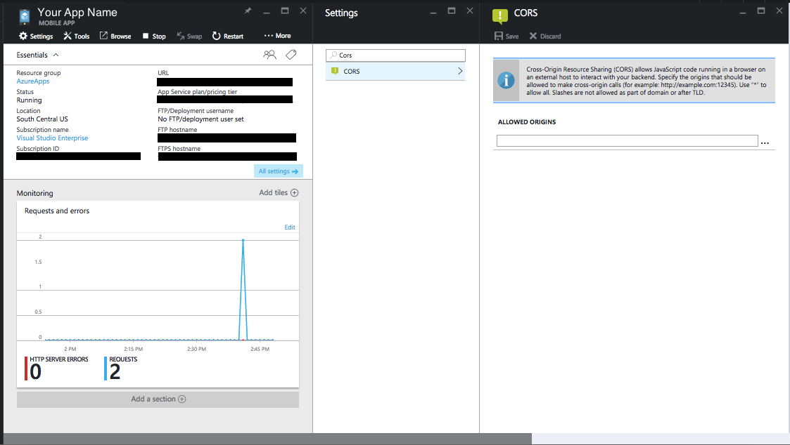
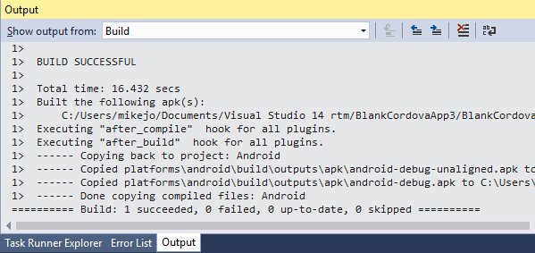
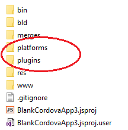
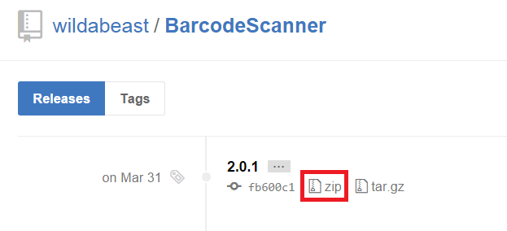
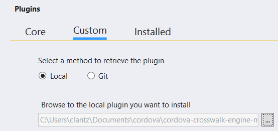
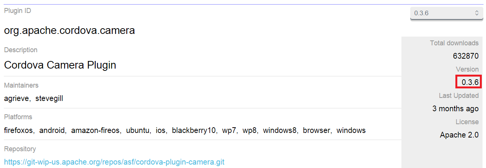

<properties pageTitle="General Cordova tips and workarounds"
  description="This is an article on bower tutorial"
  services=""
  documentationCenter=""
  authors="kirupa" />
  <tags ms.technology="cordova" ms.prod="visual-studio-dev14"
     ms.service="na"
     ms.devlang="javascript"
     ms.topic="article"
     ms.tgt_pltfrm="mobile-multiple"
     ms.workload="na"
     ms.date="05/15/2016"
     ms.author="kirupac"/>

#General Cordova tips and workarounds
This document covers tips, tricks, and known workarounds for general issues with Cordova or Tools for Apache Cordova. 

<a name="connection"></a>
##App not connecting to the internet or failing to retrieve data or resources

A Cordova app has two distinct layers of securirty. At the client-side application level, the Content Security Policy meta tag and the Whitelist plugin rules set in config.xml prevent other sites from injecting unwanted resources into your app. Errors due to a restrictive CSP usually prompt you to adjust the CSP and whiltelist rules. Learn how to set these rules in the [following guide](https://cordova.apache.org/docs/en/latest/reference/cordova-plugin-whitelist/).

The second layer is at the backend level. Web services implement Cross-Origin Resource Sharing to restrict the content that you can pull from that domain. Since all Cordova apps pull data from an external server (through RESTful API calls), you may see errors such as ```Error 500``` or like this: ```XMLHttpRequest cannot load [external connection string]. Response to preflight request doesn't pass access control check: No 'Access-Control-Allow-Origin' header is present on the requested resource. Origin [App URL] is therefore not allowed access. The response had HTTP status code 400.```

If your app is attempting to pull data from an [Azure Mobile Apps backend](https://azure.microsoft.com/en-us/documentation/articles/app-service-mobile-cordova-get-started/), Azure has a custom interface to manage exceptions to their default CORS policy.



<a name="firsttime"></a>
##Resolve build and deployment errors when you build for the first time

Try these steps.

1. Wait for the build to complete.

    When building for the first time, Visual Studio downloads and installs Cordova dependencies. The first build can take considerably longer than normal to complete.

    Similarly, when you first start an emulator, the emulator may take considerable time to load (leave the emulator open between app restarts to avoid this issue).

2. Check your Visual Studio notifications (upper right) to see if you need any updates to Visual Studio or to Visual Studio Tools for Apache Cordova. Install any updates and retry.

    

3. In Visual Studio, run the Dependency Checker by choosing **Tools**, **Options**, **Tools for Apache Cordova**, and selecting **Run Dependency Checker**. Investigate any resulting messages.
4. Check the Output window and the Error List window for build error information and guidance.

    

    If you're not sure what to do next, see the next section on resolving general build and deployment errors.

<a name="general"></a>
##Resolve general build and deployment errors

Try these steps if you have trouble deploying to emulators or devices.

1. Running on a device? Make sure that your device is enabled for development. Instructions to do this are different for each platform.
    * For Android, see [Android](android-tips.md). For iOS, see [iOS guide](../first-steps/ios-guide.md). (iOS devices need a provisioning profile.) For Windows, see [this article](../run-your-app/run-app-windows.md).
2. If you are running on a device and the app is already installed, uninstall the app and try again.
4. Delete the project's platforms/*platform* folder (such as platforms/android) and the plugins folder from the project and try again (navigating to the root of your project folder in a command window and typing the command  `cordova platforms remove android` also removes the platform).

    

    If the issue only occurs with a particular plugin, you may have an incompatibility with the plugin or between your Cordova version and the plugin version.

3. If you haven't done it already, [check your update notifications and run the dependency checker](#firsttime).
4. If you are not using a new blank project already, create an empty project using the Blank App template (you can find it under **JavaScript**, **Apache Cordova Apps** when creating a new project) and see if you get the same error when you build.
    If the Blank App template runs fine, the issue may be specific to your project.
5. Try to run your app against a different platform or emulator and see if that is successful.

    Here are a few suggested platforms for testing:
    * Try running against Android and select **Ripple - Nexus (Galaxy)** (Chrome required)
    * Open the configuration designer (config.xml), the **Windows** tab, select your OS version, and then try running against **Windows-x64** or **Windows-x86** and select **Local Machine**.

    If the issue is only on the Android platform, see [Android](android-tips.md). If the issue is only on iOS, see the troubleshooting tips in the [iOS setup guide](../first-steps/ios-guide.md). If the issue is only on Windows, see [Windows](windows-tips.md).

6. If you see a message that you are unable to start debugging or if no emulators or devices are visible as debug targets, see [this workaround](#debugging).
7. Try [clearing the cache](../tips-workarounds/configuration-tips.md#vstac) from **Tools**, **Options**, **Tools for Apache Cordova** and re-installing vs-tac.

<a name="debugging"></a>
##Unable to start debugging

If you get a message in Visual Studio that says you can't start debugging your app, try these steps. Also, try these steps if no emulators or devices are listed in the debug target dropdown list.

1. Close all instances of Visual Studio.
2. Open this folder:

    C:\Users\username\%appdata%\Local\Microsoft\Phone Tools
3. Rename the CoreCon folder to any other name (CoreCon will get recreated when you rebuild).
4. Restart Visual Studio and try again.

<a name="missingexclude"></a>
##Building a Cordova project from source control results in a successful build, but with Cordova plugin APIs not returning results when the app is run
Due to a bug in the VS templates in VS 2015 RC, four json files that can cause issues if they are added to source control, are missing from the default source code exclusion list:

- plugins/android.json
- plugins/ios.json
- plugins/windows.json
- plugins/remote_ios.json
- plugins/wp8.json.

Adding these files to source control can result in a build that appears to succeed, but is missing plugin native code. They should only be included if the "platforms" folder is also checked in, which is not recommended.

A sign that you are encountering this issue is that the build appears to succeed and the app starts up properly, but the Cordova plugin APIs does not appear to function, and no error appears in the JavaScript console. On further inspection, when you debug an Android version of your app, you might see an exception similar to the following in the **Output Window**:

```
W/System.err( 1425): java.lang.ClassNotFoundException: org.apache.cordova.camera.CameraLauncher
W/System.err( 1425):  at java.lang.Class.classForName(Native Method)
W/System.err( 1425):  at java.lang.Class.forName(Class.java:251)
W/System.err( 1425):  at java.lang.Class.forName(Class.java:216)
```

The missing class would be recognizable as a Cordova plugin class such as "org.apache.cordova.camera.CameraLauncher" from the camera plugin.

To fix this:

- Remove these files (plugins/android.json, plugins/ios.json, plugins/windows.json, plugins/remote_ios.json, and plugins/wp8.json) from source control.

- Leave plugins/fetch.json.

For **existing local copies**, you can either fetch a fresh copy from source control or delete the above files along with the entire contents of the "platforms" folder in the filesystem (which is not visible by default in the Solution Explorer) to resolve the issue.

<a name="cordovaproxy"></a>

##"TypeError: Request path contains unescaped characters" during a build or when installing a plugin
When building or installing a plugin, you might encounter an error if you are using a proxy with certain versions of Node.js and Cordova after a ```npm http GET```. For example:

```
npm http GET https://registry.npmjs.org/cordova-android/3.7.1
TypeError: Request path contains unescaped characters.
```

The root cause of this error is that certain versions of Cordova reference an older version of npm. This version has some compatibility issues with proxy settings on newer versions of Node.js. You can find additional details on the issue and potential workarounds [here](https://github.com/driftyco/ionic-cli/issues/321).

The simplest workaround is to **downgrade Node.js to 0.10.29**. This will be resolved in a future version of Cordova.

<a name="plugin-xml"></a>

##Using Plugins Not Listed in the Config Designer
Occasionally you might have to install a specific version of a Cordova plugin that's not listed in the config.xml designer. If this plugin is available in plugins.cordova.io when using any version of Cordova or npm when using Cordova 5.0.0+, you can add the following element to config.xml, and the plugin will be installed when you next build the project:

1. If any of plugins you intend to install were already added to your project (particularly with an older ID), remove them using the **Installed** tab of the **Plugins** section of the config.xml designer in Visual Studio.

2. Next, right click on config.xml in the Solution Explorer and select **View Code**

3. Add the following element to config.xml under the root widget element:

	```
  	  <vs:plugin name="org.apache.cordova.camera" version="0.3.6" />
	```

	...substituting org.apache.cordova.camera for the correct ID and 0.3.6 with the version of the plugin you want to install.

4. The next time you build the plugin will be installed for you.

You can add plugins by using a Git URI or the local filesystem by using the **Custom** tab of the **Plugins** section in the config.xml designer. Using a Git URI can cause you to get a "dev" version of a plugin. See [these instructions](#plugin-github) for how you can use a specific version of a GitHub sourced plugin.

<a name="plugin-github"></a>

## Using a Specific Version of a GitHub Sourced Plugin

From time to time you might try to use a Cordova plugin from GitHub but find that specifying the Git URI to the plugin gives you a development version rather than a release version. You can deal with this problem in one of two ways:

1. If the plugin is in plugins.cordova.io or npm (Cordova 5.0.0+), you can simply add an element to config.xml to install on next build.

2. If the plugin author is using GitHub's release features, you can access and use older versions of the plugin and install from the file system.

### Add the Plugin to Config.xml

First, if this plugin is available in plugins.cordova.io when using any version of Cordova or npm when using Cordova 5.0.0+, you can  add the following element to config.xml and the plugin will be installed when you next build the project. See [this section](#plugin-xml) for details.

Ex:

```
<vs:plugin name="org.apache.cordova.camera" version="0.3.6" />
```

This substitutes org.apache.cordova.camera for the correct ID and 0.3.6 with the version of the plugin you want to install.

### Install from a Local Copy

However, if the plugin is only available through GitHub, you can follow these steps to install a specific version:

1. Go to the GitHub repository for the plugin. Ex:

```
https://github.com/wildabeast/BarcodeScanner
```

2. Click on the **Releases** tab

3. Click on the .zip link of the version of the plugin you want to access

	

4. Unzip this plugin on your local file system

5. Add the plugin to your project from this local location by using the **Local** option in the **Custom** tab of the config.xml designer.

	

<a name="plugin-npm"></a>
##Using a Npm Sourced Plugins Not Listed in the Config Designer or with Cordova < 5.0.0

### Background

A significant departure in Cordova 5.0.0 and the community as a whole is the migration of the primary source of Cordova plugins from the custom repository backed model that exists in Cordova 3.x and 4.x to the "Node Package Manager" (npm) repository. The plugins.cordova.io repository has seen a few service interruptions and given the web community's increased use of Node.js for client-side development and Cordova's heavy use of npm for not only its command line interface but as a source for Cordova "platforms," the natural next step was to migrate plugins to npm as well. More details on this transition [can be found here.](http://cordova.apache.org/announcements/2015/04/21/plugins-release-and-move-to-npm.html)

A significant change tied to this switch over and the release of Cordova 5.0.0 that the IDs used to refer to many Cordova plugins have changed. This was done for two reasons. First, the different ID helps to re-enforce that older versions of Cordova will not get plugin updates. Rather than having an arbitrary version number where the updates stop, using a different ID makes this change over explicit. Second, the old reverse domain style for Cordova plugin IDs do not conform to community best practices for package names in npm.

As a result, core plugins like Camera have changed from [org.apache.cordova.camera](http://plugins.cordova.io/#/package/org.apache.cordova.camera) in version 0.3.6 of the plugin to [cordova-plugin-camera](https://www.npmjs.com/package/cordova-plugin-camera) in versions 1.0.0 and higher geared for Cordova 5.0.0 and up.




You can find running list of [old verses new plugin IDs in this location](https://github.com/stevengill/cordova-registry-mapper/blob/master/index.js).

In addition to the challenge of older versions of Cordova not supporting npm sourced plugins, Visual Studio 2015 currently uses the old IDs in the config.xml designer since the default template in VS uses Cordova 4.3.0 which does not support npm sourced plugins. As a result, if you want to get the latest version of a given plugin you'll need to install the npm version using one of the approaches below.

### Installing npm Source Plugins via Config.xml When Using Cordova 5.0.0+
If you are using Cordova 5.0.0+ (5.1.1+ is recommended) in your project, you can simply add an element to config.xml and the npm sourced plugin will be installed on next build in Visual Studio. Note that this will not work with Cordova versions < 5.0.0. See [this section](#plugin-xml) for details.

Ex:

```
<vs:plugin name="cordova-plugin-camera" version="1.2.0" />
```

...substituting cordova-plugin-camera for the correct ID and 1.2.0 with the version of the plugin you want to install. Be sure to remove any old versions of the plugin before adding a new one.


### Installing Npm Sourced Plugins When Using Cordova < 5.0.0

There are two primary methods to install a plugin from npm when using Cordova 4.3.1 or below: using a recent version of the Cordova CLI or the "npm" command.

> **Note**: Versions of plugins present in npm were tested on Cordova 5.0.0 or later and therefore may or may not work on earlier versions of Cordova.

#### Using Cordova CLI 5.0.0+

The simplest method to install a plugin from npm is to take advantage of Visual Studio's command line interoperability and simply use a recent version of the Cordova CLI. To do so, follow these steps:

1. If any of plugins you intend to install were already added to your project with an older ID, remove them using the **Installed** tab in the **Plugins** section of the config.xml designer in Visual Studio.

2. Next, execute the following commands from the developer command prompt:

	```
	cd path-to-project
	npm install -g cordova@5.1.1
	cordova plugin add cordova-plugin-camera
	```

	...replacing "path-to-project" with the path to the Cordova project inside your Visual Studio solution (not the solution root) and "cordova-plugin-camera" with the plugin you wish to install. You might also replace "cordova@5.1.1" with the version of Cordova you are using in your project as long as it is 5.0.0 or later.

    > **Note**: With this method you might not see these plugins listed in the **Installed** tab of the config.xml designer but they will be present in the project and included in build or source control operations.

#### Using the npm Command

Adding a Cordova plugin by using the Cordova CLI 5.0.0+ when your project is using an earlier version of Cordova (like 4.3.0) could cause unexpected results. This second procedure is more involved, but avoids risks with potential Cordova CLI incompatibilities.

1. From the command prompt:

	1. Create a folder where you want to place the npm version of your Cordova plugins. (Ex: C:\cordova-plugins)

	2. Change to this folder

	3. Type the following:

		``
		npm install cordova-plugin-camera
		``

		...replacing cordova-plugin-camera with the ID of the plugin you want to use. Be sure to omit "-g".

	4. After the command completes, inside a "node_modules" folder you will find **one or more folders** containing all the plugins you need to add to the project. (Note there may be more than one.) For example, you will see both "cordova-plugin-camera" and "cordova-plugin-file" present in the example above since the Camera plugin depends on the File plugin.

2. From Visual Studio:

	1. Add **all of the plugins** that the "npm install" command shown above placed in the "node_modules" folder.

        In the example above, both cordova-plugin-camera and cordova-plugin-file should be installed.

		1. Go to the **Custom** tab in the config.xml designer

		2. Select **Local** and select the folder where npm installed the plugin on your system. The will be in a **node_modules** sub-folder where you executed the ```npm install``` command.  (Ex: C:\cordova-plugins\node_modules)

		3. Click **Add**

		4. Repeat until all plugins in the node_modules folder have been added

	1. If any of these plugins were added to your project by using an older ID, remove them using the **Installed** tab in the config.xml designer.

<a name="plugin-troubleshoot"></a>

## Tips for Troubleshooting 3rd party Cordova Plugins
One of the advantages associated with Apache Cordova is its active plugin community. However, not all plugins are well maintained or updated the moment that a new version of Cordova comes out, and you might run into problems even with popular plugins. Here are some tips to see where the problem might exist, and how to contact a plugin author about making fixes.

1. Verify the plugin supports the platform you are currently testing by looking at the plugin's documentation. Android and iOS support is provided by most (but not all) plugins but Windows and Windows Phone 8 are not always supported by 3rd party plugins.

2. If you are specifically running into problems with the plugin after checking the project out of source control or copying from another machine, be sure that you are not encountering the issue described above [with copying or adding certain json files to source control from plugins folder](#missingexclude).

3. If you encounter an unexpected build error, see if the error references Cordova plugin source code. If so, the problem is likely with the plugin not Cordova or Tools for Apache Cordova.

4. See if there is an update to the plugin and install it by removing the plugin using the **Installed** tab of the config.xml designer and re-add the plugin.

5. Certain plugins can encounter problems when building for iOS due to their use of symlinks which are not well supported on the Windows NTFS filesystem. See [this article](ios-tips.md#symlink) for specific symptoms and a workaround.

6. See if the plugin causing problems has transitioned to npm as a part of the Cordova [repository transition](http://cordova.apache.org/announcements/2015/04/21/plugins-release-and-move-to-npm.html) and therefore has a new ID. You could have multiple copies of the same plugin installed (ex: both org.apache.cordova.camera and cordova-plugin-camera) or an outdated version of the plugin with bugs. Check the **Installed** tab of the config.xml designer for duplicates and consult [this article for information](#plugin-npm) on why the plugin ID may have changed and how to get an updated version of the plugin.

7. When using a plugin from GitHub, check the **Installed** tab of the config.xml designer to see if the version number ends in "-dev". If so, this may not be a stable version of the plugin. You can follow [this procedure](#plugin-github) to download an earlier release of the plugin to see if the problem goes away. Even if the plugin version does not end in "-dev", it may be worth trying a previous release to see if the problem you are encountering is new.

8. If a plugin update doesn't solve the issue, try these steps to eliminate other factors:
	1. Create a fresh project and see if the problem reproduces.
	2. To eliminate Visual Studio as a potential culprit, you can test using a standard Cordova CLI project by entering the following in a command prompt:

		```
		npm install -g cordova@5.1.1
		cordova create testProj
		cd testProj
		cordova platform add android
		cordova plugin add cordova-plugin-in-question
		cordova build android
		```

		... replacing the Cordova version and plugin name for those that apply to your situation. You can also specify a fully qualified Git URI or filesystem path in place of the plugin name.

9. If none of these steps help, and the problem reproduces outside of Visual Studio, you might want to contact the plugin author and let them know about the problem. Before doing so, be sure to check for existing open issue as more than likely there's already one on the plugin author's GitHub site that you can use to provide additional information. Mention that you encountered issues when using Tools for Apache Cordova but include the Cordova CLI repro for the plugin author's benefit.

One last tip: Note that modifying the contents of the **plugins** folder does not automatically cause these changes to be applied to your app. Removing and re-adding the plugin is the safest option.

<a name="build-errors-long-path"></a>

##Build errors caused by long path and file names
If your project is located inside a deeply nested directory in your file system, or you have a particularly long user name, you might receive build errors when building your project by using Visual Studio (Ex: "The filename or extension is too long"). The underlying reason has to do with NTFS filesystem limitations in Windows and how the npm packaging system for Node.js works. To resolve:

1. First, the most effective workaround is to move your projects to a location closer to the root of your drive (ie, C:\Projects\).

2. Second, if moving the project to an alternate location does not resolve your issue, it is possible that you are running into an issue with the location of the "npm cache" folder, particularly if you have a long user name (as it lives in %APPDATA%\npm-cache by default). You can resolve this issue by updating the cache location using the following command from the command prompt:

	```
	npm config set cache c:\npm\cache
	```

	...replacing "c:\npm\cache" with your desired folder.